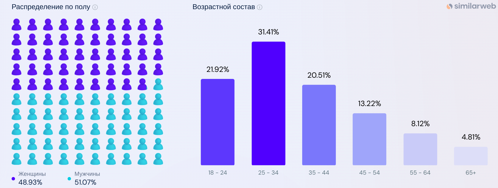

# Проектирование высоконагруженного сервиса Netflix

## Содержание:
1. [Тема и целевая аудитория](#1)

## 1. Тема и целевая аудитория:
Netflix - стриминговый сервис для просмотра фильмов и сериалов.

### Функционал MVP
- регистрация и авторизация пользователей
- просмотр фильмов и сериалов в режиме стриминга
- настраиваемый плеер (скорость воспроизведения, язык, субтитры)
- поиск фильмов и сериалов по ключевым словам
- добавления фильмов и сериалов в пользовательский список
- система рекомендаций
- отображение фильмов и сериалов, которые пользователь начал смотреть
- загрузка контента на устройство
- настройки парметров приложения (использование сотовых данных, уведомления, управление загрузками)
- управление подпиской

### Целевая аудитория

#### Анализ трафика [^1]
- количество уникальных пользователей в день (DAU) - 67.5M
- количество уникальных пользователей в месяц (MAU) - 2B
- количество страниц за визит (Pages per Visit) - 3.80
- среднее время, проведенное на сайте (Visit Duration) - 06:59
- процент пользователей, которые просматривают одну страницу, прежде чем покинуть сайт (Bounce Rate) - 42.88%

#### Демографические показатели [^2]
- состав аудитории - 51.07% мужчин и 48.93% женщин
- самая многочисленная возрастная группа посетителей - 25 - 34 лет

 #### Трафик по странам
- основное географическое положение аудитории - США

#### Подписчики
- всего подписчикой за последнюю четверть 2024 года - 300M [^3]
- новых полписчиков за последнюю четверть 2024 года - 18M [^4]

## Список источников:
[^1]: [Traffic Analysis](https://hypestat.com/info/netflix.com)

[^2]: [Traffic Demographics](https://www.similarweb.com/ru/website/netflix.com/#demographics)

[^3]: [Subscribers Fourth Quarter of 2024](https://www.statista.com/statistics/250934/quarterly-number-of-netflix-streaming-subscribers-worldwide/)

[^4]: [New Subscribers Fourth Quarter of 2024](https://www.statista.com/statistics/196645/quarterly-net-subscriber-additions-of-netflix-since-2009/)

