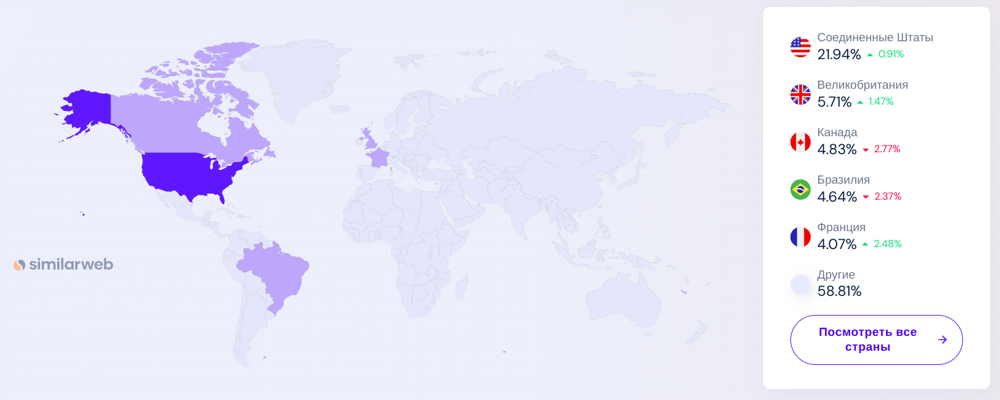
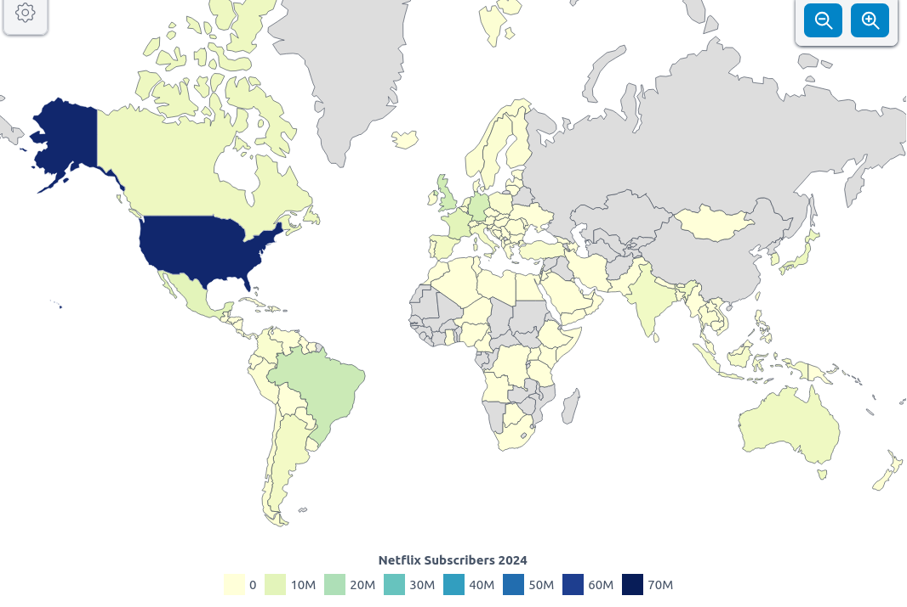
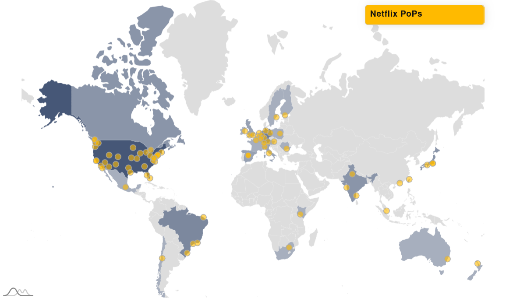
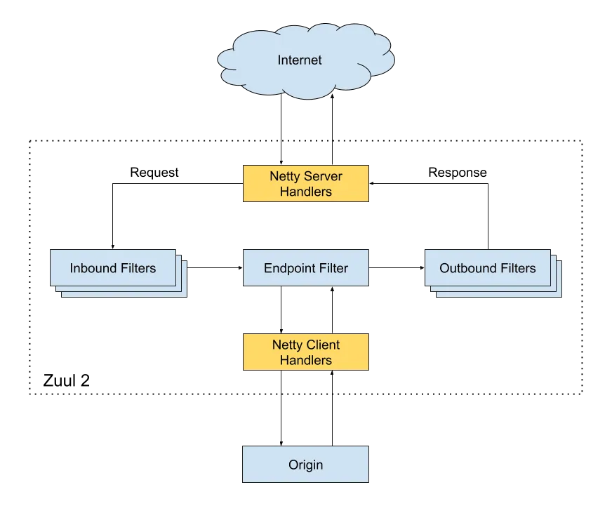
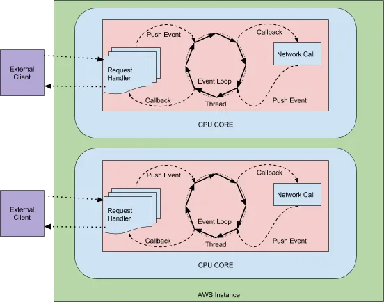

# Проектирование высоконагруженного сервиса Netflix

## Содержание:
1. [Тема и целевая аудитория](#1-тема-и-целевая-аудитория)
2. [Рассчет нагрузки](#2-расчет-нагрузки)
3. [Глобальная балансировка нагрузки](#3-глобальная-балансировка-нагрузки)
4. [Локальная балансировка нагрузки](#4-локальная-балансировка-нагрузки)

## 1. Тема и целевая аудитория
Netflix - стриминговый сервис для просмотра фильмов и сериалов.

### Функционал MVP
- регистрация и авторизация пользователей
- просмотр фильмов и сериалов в режиме стриминга
- полнотекстовый поиск по названию, жанру, актерам и режиссеру
- добавления фильмов и сериалов в избранное
- история просмотров
- система рекомендаций (общая, по событиям, на основе начатых просмотров, потребленного контента)
- push-уведомления о выходе новых сериалов и серий просмотренных сериалов

### Целевая аудитория

#### Анализ трафика
- количество уникальных пользователей в день (DAU) - 67.5M [^1]
- количество уникальных пользователей в месяц (MAU) - 2B [^1]
- среднее время просмотра стримов в день в первой четверти 2024 (daily time spent streaming) - 2 hours [^2]

 #### Трафик по странам [^3]
- основное географическое положение аудитории - США

#### Подписчики [^4]
- подписчиков на последнюю четверть 2024 года - 282.7M
- новых подписчиков за 2024 год - 22.7M (282.7M - 260.28M)

## 2. Расчет нагрузки

### Продуктовые метрики
- #### MAU = 270.8M*
- #### DAU  = 91.8M*
- средняя продолжительность подписки - 4 года [^5]
- размер библиотеки - 19_500**
- соотношение фильмов и сериалов в библиотеке - 70% и 30% соответсвенно [^6]
- 85% потребляемого пользователями в США контента - это сериалы [^7]

*В ранее приведенной статистике DAU и MAU учитываются только посещения сайта netflix.com, причем bounce rate, 
т.е. количество пользователей, которые которые покидают сайт после просмотра одной страницы, равно 42.88%.
Следовательно, эти данные не репрезентативны для подсчета выполнения целевых действий. 
За основу расчета DAU и MAU возьму MAU пользователей приложением в 2022 году 106M + 115M = 221M [^8]. 
Рассчитаем коэффициент активности пользователей, имеющих подписку. 
В 2022 подписку на Netflix имели 230.7M человек [^4], что составляет 221M / 230.7M * 100% = 95.8% от MAU.
Если предположить, что коэффициент активности пользователей не измелился, учитывая, 
что в 2024 году количество подписчиков составило 282.7M, MAU можно рассчитать как 282.7M * 0.958 = 270.8M. 
Чтобы рассчитать sticky factor рассмотрим статистику использования онлайн кинотеатров. 
28% клиентов онлайн-кинотеатров пользуются ими два-три раза в неделю,
27% респондентов заходят в онлайн-кинотеатр несколько раз в месяц, 25% — два раза в месяц, 19% — почти каждый день [^9].
Тогда в среднем пользователи используют онлайн-кинотеатры 3 * 0.28 + 1 * 0.27 + 0.5 * 0.25 + 6 * 0.19 = 2.375 раз в неделю.
Sticky фактор для Netflix можно оценить как 2.375 / 7 * 100% = 33.9%
Расситаем DAU = 0.339 * 270.8M  = 91.8M.

**В 2022 году библиотека нетфлик составила около 17_000 позиций [^10]. 
Рассчитаем примерную скорость роста библиотки. Размер библиотеки в US в 2022 году - 6473 [^11], в 2024 году - 7427 [^12]. Т.е. рост на 14.7%. 
Тогда на данный момент размер библиотеки равен 17_000 * 1.147 = 19_500.

- #### зарегистрированных пользователей - 2B
Нет точной статистики относительного общего количества пользователей, зарегистрированных на Netflix, но можно допустить, 
что общее количество зарегистрированных пользователей за все время, о которых хранятся данные, сравнимо с MAU сайта netflix.com, т.е. составляет 2B пользователей.

- #### средний размер хранилища пользователя
| Тип данных | Размер единицы данных | Количество данных на пользователя | Суммарный размер данных |
| ---------- | ----------------------------- | --------------------------------- | ----------------------- |
| Данные о профиле (логин, email, хэш пароля) | 1 КБ | 1 | 1 КБ |
| Избранное | 0.1 КБ (ID контента) КБ | 50 | 5 КБ |
| История просмотров | 0.2 КБ (ID контента + timestamp) КБ | 3310* | 662 КБ |
| Рекомендации | 30 КБ (векторы рекомендаций) | 1 | 30 КБ |
| Push-уведомления | 0.5 КБ | 30 | 15 КБ |

Итого: 1 + 5 + 30 + 662 + 15 = 713 КБ 

*Из расчета, что в библиотеке соотношение фильмов и сериалов - 70% и 30% соответсвенно, если пользователь в среднем смотрит в день 120 минут контента,
то 84 минут приходится на сериалы и 36 минут на фильмы. Тогда в день пользователь успевает посмотреть в день 84 / 45 = 1.867 серий и 36 / 90 = 0.4 фильма.
Средняя продолжительность подписки составляет 4 года. То есть пользователь успеет посмотреть 1.867 * 365 * 4 = 2726 серий и 0.4 * 365 * 4 = 584 фильма. 
Итого в истории пользователя нужно хранить 2726 + 584 = 3310 позиций.

- #### среднее количество действий пользователя по типам в день

| Наименование действия | Расчет количества действий в день | Результат |
| --- | --- | --- |
| регистрация на сайте | Рост подписчиков за год составил 22.7M, т.е. это 22.7M / 365 = 62_192 регистрации в день. Тогда один пользователь регистрируется 62_192 / 91.8M = 0.0007 раз в день | 0.0007 |
| просмотр видео* | Поскольку в среднем просмотр контента составляет 2 часа в день, то пользователь за это время запрашивает 2 * 3600 / 4 = 1800 сегментов | 1800 |
| поиск | Предположим, что пользователь ищет, что посмотреть раз в два дня (т.к. основной контент - сериалы и пользователь не успеет досмотреть сериал за один день), при этом при поиске последовательно применяются фильтры - 5 раз. Итого 0.5 * 5 = 2.5 | 2.5 |
| просмотр страницы фильма или сериала | Пользователи, скорее всего, при каждом действии поиска заходят хотя бы 2 раза посмотреть, что выдал поиск, а также могут открывать страницы фильмов и сериалов на главной странице. Итого примерно 7 действий | 7 |
| просмотр трейлера на странице фильма или сериала | Будем исходить из расчета, что пользователь на каждой пятой открытой странице заходит посмотреть трейлер, т.е. 7 * 0.2 = 1.4 действия | 1.4 |
| просмотр избранного | Редкое действие, примерно раз в неделю | 0.1 |
| обращение к истории просмотров | Предположим, что пользователи чаще всего используют поиск, чтобы продолжить смотреть сериал. С учетом соотношения просмотра фильмов и сериалов, это примерно 0.85 раз в день | 0.85 |
| просмотр уведомлений | За два часа пользователь не успеет посмотреть много уведомлений, но за день посещения в ему должно прийти хотя бы одно уведомление | 1.5 |

*При подсчета количества запросов, которые отправляет пользователь при просмотре видео необходимо учитывать, 
что для раздачи контента Netflix использует протокол DASH, который подразумевает разделение загружаемого контента на сегменты 
и в зависисмости от скорости соединения определяется сегменты какого разрешения будут направляться пользователю. За размер сегмента возьмем 4 сек [^13].

### Технические метрики

- #### Размер хранения

<ins>**Типы хранимых файлов**</ins> 
***Видео*** 
В облачных хранилищах нетфликс хранятся типа видео: *оригинальное видео* и *закодированные видео* (для быстрой отдачи контента разного качества) 
Есть два основных типа контента: фильмы и сериалы. Соотношение фильмов и сериалов - 70% и 30% соответсвенно. 
Т.е. количество фильмов - 0.7 * 19_500 = 13_650, сериалов - 0.3 * 19_500 = 5_850. 
Средняя продолжительность фильма - 90 мин = 1.5 ч.
Средняя продолжительность серии - 45 мин, среднее количество серий в сериале - 16 [^14], средняя общая продолжительность - 45 мин * 16 = 720 мин = 12 ч

***Данные, связанный со страницей фильма или сериала*** 
| Тип данных | Размер единицы данных | Количество данных на позицию | Суммарный размер данных |
| ---------- | ----------------------------- | --------------------------------- | ----------------------- |
| Картинка | 300 Кб | 1 | 300 Кб |
| Трейлер | 300_000 Кб | 1 | 300_000 Кб |
| Описание | 1 Кб | 1 | 1 Кб |
| Фото актеров | 100 Кб | 10 | 10_000 Кб |

Итого: 300 + 300_000 + 1 + 10_000 = 310_301 Кб*

*без трейлера: 300 + 1 + 10_000 = 10_301 Кб

Общее количество актеров для подсчета размера в хранилище = 56_438 [^15]

<ins>**Размер единицы контента закодированного видео**</ins> 
| Качество | Размер часа контента в Гб [^16] | Процент от общего контента | Размер сегмента длительностью 4 cек|
| --- | --- | --- | --- |
| Low | 0.3 Гб | 5% | 349.5 Кб |
| Medium | 0.7 Гб | 15% | 815.6 Кб |
| SD | 1 Гб | 10% | 1165.1 Кб |
| HD | 3 Гб | 50%* | 3495.3 Кб |
| Ultra HD | 7 Гб | 20%** | 8155.5 Кб |

*наиболее популярно в мире 
**наиболее популярно в США

<ins>**Размер единицы контента оригинального видео**</ins> 
Рассчитаем, сколько весит оригинальный RAW видео-файл, который потом кодируется для передачи пользователю.
Одна секунда весит 150Мб, т.е. 150 * 3600 / 1024 = 530Гб весит час видео [^17].
Каждый такой оригинальный файл хранится в 3 экземплярах [^18].

<ins>**Размер хранения оригинальных фильмов**</ins>
| Размер часа | Продолжительность единицы контента (1 фильм) | Количество единиц | Размер в Тб |
| --- | --- | --- | --- |
| 530 Гб | 1.5 ч | 13_650 * 3 | 31_792 Тб |

<ins>**Размер хранения оригинальных сериалов**</ins>
| Размер часа | Продолжительность единицы контента (1 сериал) | Количество единиц | Размер в Тб |
| --- | --- | --- | --- |
| 530 Гб | 12 ч | 5_850 * 3 | 109_002 Тб |

<ins>**Размер хранения закодированных фильмов**</ins>
| Качество | Размер часа | Продолжительность единицы контента (1 фильм) | Количество единиц | Размер в Гб |
| --- | --- | --- | --- | --- |
| Low | 0.3 Гб |  1.5 ч | 13_650 | 6142.5 Гб |
| Medium | 0.7 Гб |  1.5 ч | 13_650 | 14_332.5 Гб |
| SD | 1 Гб |  1.5 ч | 13_650 | 20_475 Гб |
| HD | 3 Гб |  1.5 ч | 13_650 | 61_425 Гб |
| Ultra HD | 7 Гб |  1.5 ч | 13_650 | 143_325 Гб |

Итого: = 6142.5 + 14_332.5 + 20_475 + 61_425 + 143_325 = 245_700 Гб = 239.94 Тб

<ins>**Размер хранения закодированных сериалов**</ins>
| Качество | Размер часа | Продолжительность единицы контента (1 сериал) | Количество единиц | Размер в Гб |
| --- | --- | --- | --- | --- |
| Low | 0.3 Гб |  12 ч | 5_850 | 21_060 Гб |
| Medium | 0.7 Гб |  12 ч | 5_850 | 49_140 Гб |
| SD | 1 Гб |  12 ч | 5_850 | 70_200 Гб |
| HD | 3 Гб |  12 ч | 5_850 | 210_600 Гб |
| Ultra HD | 7 Гб |  12 ч | 5_850 | 491_400 Гб |

Итого: 21_060 + 49_140 + 70_200 + 210_600 + 491_400 = 842_400 Гб = 822.66 Тб

<ins>**Размер хранения пользовательских данных**</ins>
| Размер единицы | Количество единиц | Размер в Тб |
| --- | --- | --- |
| 713 Кб | 2B | 1_328 Тб |

<ins>**Размер хранения данных, связанных со страницей фильма или сериала**</ins>
| Тип данных | Размер единицы данных | Количество данных | Суммарный размер данных |
| ---------- | --------------------- | ----------------- | ----------------------- |
| Картинка | 300 Кб | 19_500 | 5707 Mб |
| Трейлер | 300_000 Кб | 19_500 | 5_712_891 Mб |
| Описание | 1 Кб | 19_500 | 19 Mб |
| Фото актеров | 100 Кб | 56_438 | 5511 Mб |

Итого: 5707 + 5_712_891 + 19 + 5511 = 5_724_128 Mб = 5.46 Тб

**Итого: 31_792 + 109_002 + 239.94 + 822.66 + 1_328 + 5.46 = 143_190.06 Тб = 139.83 Пб**

- #### Сетевой трафик
Prime time для просмoтора ТV-шоу в среднем приходится на промежуток 20.00 - 23.00, то есть чтобы определить пиковую нагрузку нужно посмотреть, у каких стран с наибольшим количеством зрителей может пересечься prime-time (разница во времени в странах составляем менее 3-х часов). Это США, Канада и Бразилия, т.е. примерно 30% всех пользователей. Если считать, что в течение 3-х часов prime time нашрузка распледеляется равномерно, то можно считать, что в пиковый час нагрузки сервисом совершаются 10% действий. 
Тогда   
0.1 * DAU * количество действий в день - количество действий в пиковый час. 
0.1 * суммарный суточный трафик / 3600 * 8 - пиковое потребление в течение суток

| Наименование действия | Расчет суммарного суточного трафика | Суммарный суточный трафик | Пиковое потребление в течение суток |
| --- | --- | --- | --- |
| регистрация на сайте | 91.8M * 0.0007 * 1Кб / (1024 * 1024) | 0.06 Гбайт/сутки | 0.00001 Гбит/сек |
| просмотр видео в формате Low | (91.8M * 0.05) * 1800 * 349.5 Кб / (1024 * 1024) | 2_753_800 Гбайт/сутки | 612.0 Гбит/сек |
| просмотр видео в формате Medium | (91.8M * 0.15) * 1800 * 815.6 Кб / (1024 * 1024) | 19_278_967 Гбайт/сутки | 4284.2 Гбит/сек |
| просмотр видео в формате SD | (91.8M * 0.1) * 1800 * 1165.1 Кб / (1024 * 1024) | 18_360_245 Гбайт/сутки | 4080.1 Гбит/сек |
| просмотр видео в формате HD | (91.8M * 0.5) * 1800 * 3495.3 Кб / (1024 * 1024) | 275_403_677 Гбайт/сутки | 61_200.8 Гбит/сек |
| просмотр видео в формате Ultra HD | (91.8M * 0.2) * 1800 * 8155.5 Кб / (1024 * 1024) | 257_037_128 Гбайт/сутки | 57_119.4 Гбит/сек |
| поиск | 91.8M * 2.5 * 1024 Кб / (1024 * 1024) | 224_121 Гбайт/сутки | 49.8 Гбит/сек |
| просмотр страницы фильма или сериала | 91.8M * 7 * 10_301 Кб / (1024 * 1024) | 6_312_773 Гбайт/сутки | 1402.8 Гбит/сек |
| просмотр трейлера на странице фильма или сериала | 91.8M * 1.4 * 300_000 Кб / (1024 * 1024) | 36_769_867 Гбайт/сутки | 8171.1 Гбит/сек |
| обращение к истории просмотров | 91.8M * 0.85 * 662 Кб / (1024 * 1024) | 49_263 Гбайт/сутки | 10.9 Гбит/сек |
| просмотр уведомлений | 91.8M * 1.5 * 15 Кб / (1024 * 1024) | 1970 Гбайт/сутки | 0.4 Гбит/сек |

Итого: 
Сумарный суточный трафик =  0.00001 + 2_753_800 + 19_278_967 + 18_360_245 + 275_403_677 + 257_037_128 + 49.8 + 6_312_773 + 36_769_867 + 49_263 + 1970 = 615_967_739.8 Гбайт/сутки 
Пиковое потребление в течение суток = 0.00001 + 612.0 + 4284.2 + 4080.1 + 61_200.8 + 57_119.4 + 49.8 + 1402.8 + 8171.1 + 10.9 + 0.4 = 136_931.5 Гбит/сек

- #### RPS в разбивке по типам запросов 
DAU * количество действий в день / 86_400 - средний RPS 
0.1 * DAU * количество действий в день / 3600 - пиковый RPS

| Наименование действия | Расчет среднего RPS | Средний RPS | Расчет пикового RPS | Пиковый RPS |
| --- | --- | --- | --- | --- |
| регистрация на сайте | 91.8M  * 0.0007 / 86_400 | 1 | 0.1 * 91.8M * 0.0007 / 3600 | 2 |
| просмотр видео в формате Low | (91.8M * 0.05) * 1800 / 86_400 | 95_625 | (0.1 * 91.8M * 0.05) * 1800 / 3600  | 229_500 |
| просмотр видео в формате Medium | (91.8M * 0.15) * 1800 / 86_400 | 286_875 | (0.1 * 91.8M * 0.15) * 1800 / 3600 | 688_500 |
| просмотр видео в формате SD | (91.8M * 0.1) * 1800 / 86_400 | 191_250 | (0.1 * 91.8M * 0.1) * 1800 / 3600 | 459_000 |
| просмотр видео в формате HD | (91.8M * 0.5) * 1800 / 86_400 | 956_250 | (0.1 * 91.8M * 0.5) * 1800 / 3600 | 2_295_000 |
| просмотр видео в формате Ultra HD | (91.8M * 0.2) * 1800 / 86_400 | 382_500 | (0.1 * 91.8M * 0.2) * 1800 / 3600 | 918_000 |
| поиск | 91.8M * 2.5 / 86_400 | 2656 | 0.1 * 91.8M * 2.5 / 3600 | 6375 |
| просмотр страницы фильма или сериала | 91.8M * 7 / 86_400 | 7438 | 0.1 * 91.8M * 7 / 3600 | 17_850 |
| просмотр трейлера на странице фильма или сериала |  91.8M * 1.4 / 86_400 | 1487 | 0.1 * 91.8M * 1.4 / 3600 | 3570 |
| обращение к истории просмотров | 91.8M * 0.85 / 86_400 | 903 | 0.1 * 91.8M * 1 / 3600 | 2550 |
| просмотр уведомлений | 91.8M * 1.5 / 86_400 | 1594 | 0.1 * 91.8M * 1.5 / 3600 | 3825 |

## 3. Глобальная балансировка нагрузки

Для доставки контента конечному пользователю Netflix использует систему Open Connect. В состав ее серверов входят:
Origin - облачные AWS-хранилища нетфликса. Из Origin отдается динамический контент (генерируемый в момент получения запроса) и статический, не сохраненный в кэше. PoP - OCA (Open Connect Applience) - кэширующий сервер, который Netflix предоставляет провайдеру. Локальные PoP сервера принадлежат сети провайдера, региональные - сети Netflix. Нетфликс заранее предсказывает,
какой контент будет популярен, и в незагруженное время отправляет кэши на OCA сервера, чтобы оттуда провайдер мог напрямую их отдавать клиенту [^19].

### Функциональное разбиение по доменам 
- netflix.com - основной домен для управления аккаунтами и подписками
- netflix.net - домен кэширования ресурсов и перенаправления к ближайшим CDN-серверам
- nflxso.net - домен управления сессиями
- nflxvideo.net - домен доставки видео
- nflximg.com / nflximg.net - домены доставки изображений (постеры фильмов и сериалов, фото актеров и т.д.)

### Расположение CDN

Региональные PoP следует размещать рядом с крупными IXP с учетом количества пользователей, подписанныех на Netflix в данной локации.

Графически распределение подписчиков Netflix по странам [^20]

Расположение PoP серверов [^21]

| Регион | Местоположение PoP | Крупные IXP | Обоснование выбора местоположения |
| --- | --- | --- | --- |
| Северная Америка | Альбукерке, Эшберн, Атланта, Бостон, Чикаго, Даллас, Денвер, Детройт, Хьюстон, Канзас-Сити, Лас-Вегас, Лос-Анджелес, Майами, Миннеаполис, Нью-Йорк, Ньюарк, Норфолк, Филадельфия, Финикс, Питтсбург, Портленд, Ричмонд, Солт-Лейк-Сити, Сан-Диего, Сан-Хосе, Санта-Клара, Сиэтл, Секаукус, Сент-Луис, Тампа, Вашингтон, Венатчи, Лэнгли, Торонто, Ванкувер, Мехико | - Equinix Ashburn (Эшберн) - DE-CIX New York (Нью-Йорк) - LINX NoVA (Норфолк) - TorIX (Торонто) - MEX-IX (Мехико) | США — крупнейший рынок Netflix с 66,7 млн подписчиков. PoP распределены по всей стране для обеспечения низкой задержки и высокой доступности. Канада (6,7 млн подписчиков) и Мексика (10 млн подписчиков) также имеют PoP в ключевых городах для обслуживания своих регионов. |
| Южная Америка | Форталеза, Порту-Алегри, Рио-де-Жанейро, Сан-Паулу, Сантьяго | - IX.br (Сан-Паулу, Рио-де-Жанейро, Порту-Алегри, Форталеза) - Chile-IX (Сантьяго) | Бразилия — второй по величине рынок Netflix с 15,3 млн подписчиков. PoP в крупных городах Бразилии обеспечивают покрытие для страны и соседних регионов. Сантьяго обслуживает Чили и южную часть континента. |
| Европа | Вена, Брюссель, Хельсинки, Париж, Берлин, Дюссельдорф, Франкфурт, Гамбург, Мюнхен, Дублин, Милан, Рим, Амстердам, Варшава, Бухарест, Мадрид, Трес-Кантос, Стокгольм, Цюрих, Бристоль, Лондон | - DE-CIX Frankfurt (Франкфурт) - AMS-IX (Амстердам) - LINX (Лондон) - France-IX (Париж) - VIX (Вена) - Netnod (Стокгольм) - SwissIX (Цюрих) | Европа — ключевой регион с высоким числом подписчиков: Великобритания (14,1 млн), Германия (13,2 млн), Франция (10,1 млн). PoP распределены по крупным городам и IXP для обеспечения низкой задержки и высокой пропускной способности. |
| Азия | Гонконг, Ченнаи, Мумбаи, Нью-Дели, Кото, Осака, Токио, Сингапур, Тайбэй | - HKIX (Гонконг) - NIXI (Мумбаи, Нью-Дели, Ченнаи) - JPNAP (Токио, Осака) - SGIX (Сингапур) - TWIX (Тайбэй) | Азия — быстрорастущий рынок. Япония (7 млн подписчиков) и Индия (5,5 млн подписчиков) имеют PoP в крупных городах. Сингапур и Гонконг — ключевые узлы для Юго-Восточной Азии. |
| Африка | Найроби, Йоханнесбург | - NAPAfrica (Йоханнесбург) - KIXP (Найроби) | Африка — развивающийся рынок. PoP в Найроби и Йоханнесбурге обеспечивают покрытие для Восточной и Южной Африки соответственно. |
| Океания | Сидней, Окленд | - IX Australia (Сидней) - NZIX (Окленд) | Австралия (6,5 млн подписчиков) и Новая Зеландия обслуживаются через PoP в Сиднее и Окленде, обеспечивая низкую задержку для региона. |

### Расположение ДЦ
ДЦ следует располагать в крупных хабах трафика, а также учитывать протяженность террритории, которую можно покрыть данным ДЦ.
В Netflix ДЦ распологаются в AWS хранилищах.
| Регион | Местоположение ДЦ | Обоснование выбора местоположения |
| --- | --- | --- |
| Северная Америка | Эшберн, Лос-Анджелес, Чикаго, Торонто, Мехико | Эшберн — крупнейший хаб для трафика в США. Лос-Анджелес и Чикаго покрывают западное и центральное побережья США. Торонто обслуживает Канаду, а Мехико — Мексику и Латинскую Америку. |
| Южная Америка | Сан-Паулу, Сантьяго | Сан-Паулу — крупнейший город Бразилии. Сантьяго обслуживает Чили и южную часть континента. |
| Европа | Франкфурт, Амстердам, Лондон, Париж, Стокгольм | Франкфурт и Амстердам — ключевые узлы для европейского трафика. Лондон и Париж покрывают Западную Европу, а Стокгольм — Северную Европу. |
| Азия | Токио, Сингапур, Мумбаи, Гонконг | Токио — ключевой хаб для Японии. Сингапур обслуживает Юго-Восточную Азию, Мумбаи — Индию, а Гонконг — Восточную Азию. |
| Африка | Йоханнесбург, Найроби | Йоханнесбург покрывает Южную Африку, а Найроби — Восточную Африку. |
| Океания | Сидней | Сидней — крупнейший город Австралии, обслуживающий также Новую Зеландию. |

### Расчет распределение запросов из секции "Расчет нагрузки" по типам запросов по датацентрам
Для расчета использую расширенную статистику количества подписчиков на Netflix по странам [^22].
| Регион | Страны | Суммарное количество подписчиков | Процент от общего количества подписчиков |
| --- | --- | --- | --- |
| Северная Америка | США, Канада, Мексика, Доминиканская Республика, Коста-Рика, Панама, Гватемала, Гондурас, Сальвадор, Тринидад и Тобаго, Багамские Острова, Ямайка | 81_440_100 + 9_048_900 + 13_874_980 + 1_206_520 + 452_445 + 452_445 + 211_141 + 150_815 + 150_815 + 150_815 + 60_326 + 90_489 = 108_289_792 | 108_289_792 / 290_805_433 ≈ 37.2% |
| Южная Америка | Бразилия, Аргентина, Колумбия, Чили, Перу, Эквадор, Уругвай, Парагвай, Боливия, Венесуэла, Гайана, Суринам | 16_589_650 + 6_334_230 + 6_032_600 + 2_413_040 + 1_809_780 + 904_890 + 452_445 + 452_445 + 271_467 + 301_630 + 60_326 + 30_163 = 36_652_666 | 36_652_666 / 290_805_433 ≈ 12.6% |
| Европа | Великобритания, Германия, Франция, Испания, Италия, Нидерланды, Польша, Швейцария, Швеция, Бельгия, Дания, Норвегия, Австрия, Ирландия, Финляндия, Португалия, Румыния, Венгрия, Чехия, Греция, Украина, Словакия, Болгария, Сербия, Хорватия, Словения, Литва, Латвия, Эстония, Босния и Герцеговина, Северная Македония, Мальта, Черногория, Албания, Молдова | 18_399_430 + 16_589_650 + 13_573_350 + 7_842_380 + 5_730_970 + 4_222_820 + 3_921_190 + 2_413_040 + 2_413_040 + 2_262_225 + 1_658_965 + 1_598_639 + 1_508_150 + 1_357_335 + 1_236_683 + 1_206_520 + 1_176_357 + 965_216 + 935_053 + 904_890 + 512_771 + 422_282 + 331_793 + 271_467 + 211_141 + 211_141 + 211_141 + 180_978 + 120_652 + 120_652 + 60_326 + 60_326 + 30_163 + 90_489 + 60_326 = 86_000_000 | 86_000_000 / 290_805_433 ≈ 29.6% |
| Азия | Индия, Япония, Южная Корея, Индонезия, Филиппины, Тайвань, Малайзия, Таиланд, Сингапур, Саудовская Аравия, Вьетнам, Гонконг, Бангладеш, Кувейт, Оман, Катар, Азербайджан, Армения | 12_366_830 + 9_048_900 + 8_355_151 + 4_222_820 + 2_714_670 + 2_413_040 + 2_262_225 + 2_111_410 + 1_809_780 + 1_809_780 + 1_206_520 + 1_206_520 + 301_630 + 301_630 + 180_978 + 150_815 + 60_326 + 30_163 = 50_000_000 | 50_000_000 / 290_805_433 ≈ 17.2% |
| Африка | Южная Африка, Нигерия, Кения, Египет, Тунис, Алжир, Ангола, Эфиопия | 1_206_520 + 150_815 + 90_489 + 90_489 + 60_326 + 60_000 + 30_163 + 30_163 = 1_718_965 | 1_718_965 / 290_805_433 ≈ 0.6% |
| Океания | Австралия, Новая Зеландия | 6_937_490 + 1_206_520 = 8_144_010 | 8_144_010 / 290_805_433 ≈ 2.8% |

| Наименование действия | Северная Америка (37.2%) | Южная Америка (12.6%) | Европа (29.6%) | Азия (17.2%) | Африка (0.6%) | Океания (2.8%) |
| --- | --- | --- | --- | --- | --- | --- |
| регистрация на сайте | 0.37 | 0.13 | 0.30 | 0.17 | 0.01 | 0.03 |
| просмотр видео в формате Low | 35_550 | 12_050 | 28_350 | 16_470 | 570 | 2_670 |
| просмотр видео в формате Medium | 106_650 | 36_150 | 85_050 | 49_410 | 1_710 | 8_010 |
| просмотр видео в формате SD | 71_100 | 24_100 | 56_700 | 32_940 | 1_140 | 5_340 |
| просмотр видео в формате HD | 355_500 | 120_500 | 283_500 | 164_700 | 5_700 | 26_700 |
| просмотр видео в формате Ultra HD | 142_200 | 48_200 | 113_400 | 65_880 | 2_280 | 10_680 |
| поиск | 988 | 335 | 788 | 458 | 16 | 74 |
| просмотр страницы фильма или сериала | 2_766 | 938 | 2_206 | 1_282 | 44 | 208 |
| просмотр трейлера на странице фильма или сериала | 553 | 188 | 441 | 256 | 9 | 42 |
| обращение к истории просмотров | 336 | 114 | 268 | 156 | 5 | 25 |
| просмотр уведомлений | 593 | 201 | 473 | 275 | 10 | 45 |

### Схема DNS балансировкив
В Netflix используется latency-based балансировка на основе Route 53. 
Route 53 принадлежит Amazon, который имеет сервера по всему миру. Это позволяет Route 53 на основе анализа latency до большого числа ресурсов строить оптимальные маршруты для конечных пользователей Netflix.

### Схема Anycast балансировки
Netflix также использует Anycast балансировку. 
Anycast — это метод маршрутизации, при котором один и тот же IP-адрес может быть назначен нескольким устройствам в разных частях сети. 
Это позволяет распределить нагрузку между серверами, а также повысить отказоустойчивость (трафик автоматически начнет направляться на другой ДЦ).
Netflix имеет 4 диапозона anycast [^21], которые предположительно связаны распределением по разным регионам (скорее всего, Северная Америка, Европа, Азия, Австралия).

## 4. Локальная балансировка нагрузки

### DNS балансировка
В качестве Service Discovery в Netflix используется **Eureka** [^23]. Eureka обеспечивает балансировку нагрузки между конечными сервиса (round-robin), а также их отказоустойчивость.  
Сервисы должны каждые 30 секунд подтвержать свою жизнеспособность (продлевать аренду). Если сервис в течение 90 секунд не подтверждает аренду, он удаляется из реестра.  

Подход с использованием Eureka Netflix противопоставляет L7 балансировщику AWS Elastic Load Balancer. Преимущества Eureka:
- нелипкие сессии (REST) лучше подходят для autoscaling в AWS
- не является прокси =>
    - клиенты после получения информации о сервисы напрямую к нему обращаются
    - полученная информация может кэшироваться на клиенте (повышение отказоустойчивости)
    - небольшая экономия latency, потому что нет 2 hop-ов через proxy

### L7 балансировка
Zuul 2 представляет собой API Gateway и является главной точкой входа во всю инфраструктуру. Используется для маршрутизации внутреннего и внешнего трафика. Всего существует около 80 кластеров Zuul. В одном кластере насчитывается порядка 100 экземпляров Zuul.

#### High-level Architecture [^24]

 
- **Netty** осуществляет проксирование, обработку протоколов прикладного уровня и отвечает за соединения с серверами сервисов.
- **Inbound filters** отрабатывают до проксирования и отвечают за аутентификацию, рутинг (модификация URL) и декорирование запросов.
- **Endpoint filters** используются для отдачи статики и проксирования до бэкенд серверов.
- **Outbound filters** отрабатывают, когда ответ уже был получен и используются для сжатия ответа или добавления/удаления кастомных заголовков.

#### Low-level Architecture [^25][^26]
Внутри Netty есть система установления соединений с серверами. В ней используются event loops (по одному на каждое ядро экземпляра Zuul), distribution ring и пулы соединений.
- **Event loops** используются для хранения всех запросов, пришедших на сервер для их дальней передачи. Event loop для конкретного запроса определяет Netty.

_Принцип работы event loop_
- **Distribution ring** используется для определения множества серверов, к которым каждый event loop может обращаться. 
В основе функционирования distribution ring лежит бинарный вариант Van der Corput последовательности. Каждому новому сервису присвается число из этой последовательности из интервала [0; 1], а сама последовательность устроена так, что добавление и удаление нового сервиса не требует пересчета всех остальных, сохраняя их равномерное распределние по кругу. 
Таким образом, проходя по кругу с определенным шагом, можно определить множество серверов, к которым может обращаться конкретный event loop для данного сервиса. 
При этом event loops могут обращаться к одним и тем же множествам, количество таких повторений определяется показателем replication factor. 
Сведения о новых или удаленных узлах берутся из ***Eureka***.  
- **Choice-of-2** - это алгоритм, по которому происходит итоговый выбор сервера из множества. Сначала выбираются 2 рандомных из множества, а потом на основании данных о нагрузке, которые бэкенды пассивно (чтобы не нагружать Zuul) передают серверам, из этих двух выбирается 1.
- **Пулы соединений** открываются для кажного event loop. Выбор подможества серверов для сервиса на предыдущем шаге был необходим, чтобы держать небольшое количество соединений в каждом пуле.

### BGP (Routing) балансировка
Можно предположить, что в качестве балансировщика между кластерами Zuul и экземплярами внутри кластера Zuul используется Routing балансировка, за счет выстраивания симметричной топологии сети и распределения нагрузки алгоритмом хэширования.

### SSL терминация
Zuul выступает единой точкой входа, обрабатывающей TLS/SSL для всех входящих запросов. Для всех устройств  Netflix поддерживает TLS 1.3. В качестве оптимизации можно использовать Session Ticket Resumption. Сервер генерирует session ticket  после первоначального рукопожатия. Этот билет включает необходимые параметры сеанса, зашифрованные с помощью специфичного для сервера ключа. Клиент сохраняет этот ticket и предъявляет его при возобновлении сеанса, чтобы быстро возобновить защищенный сеанс.

## Список источников:
[^1]: [Traffic Analysis](https://hypestat.com/info/netflix.com)

[^2]: [Time Spent Streaming](https://www.statista.com/statistics/1497100/time-spent-streaming-netflix-per-account/)

[^3]: [Traffic Demographics](https://www.similarweb.com/ru/website/netflix.com/#demographics)

[^4]: [Netflix Subscribers](https://www.demandsage.com/netflix-subscribers/)

[^5]: [Average Subscription Duration](https://www.tvtechnology.com/news/streaming-stickiness-netflix-and-prime-video-have-longest-subscription-durations)

[^6]: [Films And TV Shows Statistics](https://www.kaggle.com/datasets/shivamb/netflix-shows)

[^7]: [TV Series Watching Statistics](https://www.comparitech.com/blog/vpn-privacy/netflix-statistics-facts-figures/#:~:text=The%20average%20Netflix%20user%20has%20watched%2062%20days%E2%80%99%20worth%20of%20TV%20shows%20and%20movies%20since%20creating%20an%20account)

[^8]: [App MAU](https://www.statista.com/statistics/1251899/netflix-app-monthly-active-users-worldwide/)

[^9]: [How Often People Watch Online Movie Theater](https://www.rbc.ru/rbcfreenews/620d4eeb9a794734587b6ebe)

[^10]: [Library Size](https://www.comparitech.com/blog/vpn-privacy/netflix-statistics-facts-figures/#:~:text=Netflix%20has%20over%2017%2C000%20titles,libraries%20as%20of%20October%202022)

[^11]: [Library Size In The US 2022](https://www.whats-on-netflix.com/news/netflix-library-by-the-numbers-2022/)

[^12]: [Library Size In The US 2024](https://www.whats-on-netflix.com/news/netflix-library-by-the-numbers-2024/)

[^13]: [DASH Segment Size](https://bitmovin.com/blog/mpeg-dash-hls-segment-length/)

[^14]: [Serials Statistics](https://thetechy.life/how-many-seasons-is-it/)

[^15]: [Actors Statistics](https://www.kaggle.com/datasets/dgoenrique/netflix-movies-and-tv-shows)

[^16]: [Data Used Per Hour](https://help.netflix.com/en/node/87)

[^17]: [RAW Video File Size](https://www.broadcastbeat.com/what-is-raw-video-and-why-its-needed/)

[^18]: [Cloud Storage Architecture](https://netflixtechblog.medium.com/netflixs-media-landscape-evolution-from-3-2-1-to-cloud-storage-optimization-77e9a19171ed)

[^19]: [Netflix CDN](https://habr.com/ru/articles/409583/)

[^20]: [Netflix Users By Country](https://worldpopulationreview.com/country-rankings/netflix-users-by-country)

[^21]: [Netflix Network Map](https://www.netify.ai/resources/networks/netflix)

[^22]: [Netflix Subscribers Count By Country](https://flixpatrol.com/streaming-service/netflix/subscribers/)

[^23]: [Cloud Load Balancing And Failover Tool Eureka](https://netflixtechblog.com/netflix-shares-cloud-load-balancing-and-failover-tool-eureka-c10647ef95e5)

[^24]: [Zuul 2 Architecture](https://netflixtechblog.com/open-sourcing-zuul-2-82ea476cb2b3)

[^25]: [Rethinking Netflix’s Edge Load Balancing](https://netflixtechblog.com/netflix-edge-load-balancing-695308b5548c)

[^26]: [Curbing Connection Churn in Zuul](https://netflixtechblog.com/curbing-connection-churn-in-zuul-2feb273a3598)