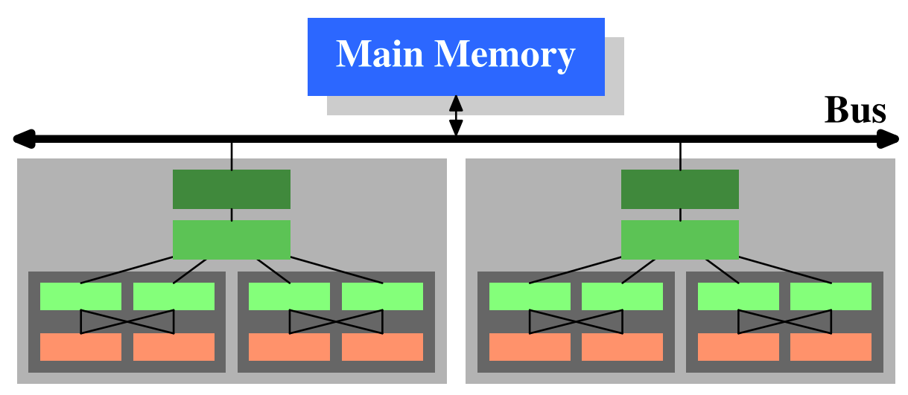

# Проектирование высоконагруженного сервиса Netflix

## Содержание:
1. [Тема и целевая аудитория](#1-тема-и-целевая-аудитория)
2. [Рассчет нагрузки](#2-расчет-нагрузки)
3. [Глобальная балансировка нагрузки](#3-глобальная-балансировка-нагрузки)
4. [Локальная балансировка нагрузки](#4-локальная-балансировка-нагрузки)
5. [Логическая схема БД](#5-логическая-схема-бд)
6. [Физическая схема БД](#6-физическая-схема-бд)
7. [Алгоритмы](#7-алгоритмы)

## 1. Тема и целевая аудитория
Netflix - стриминговый сервис для просмотра фильмов и сериалов.

### Функционал MVP
- регистрация и авторизация пользователей
- просмотр фильмов и сериалов в режиме стриминга
- полнотекстовый поиск по названию, жанру, актерам и режиссеру
- добавления фильмов и сериалов в избранное
- история просмотров
- система рекомендаций (общая, по событиям, на основе начатых просмотров, потребленного контента)
- push-уведомления о выходе новых сериалов и серий просмотренных сериалов

### Целевая аудитория

#### Анализ трафика
- количество уникальных пользователей в день (DAU) - 67.5M [^1]
- количество уникальных пользователей в месяц (MAU) - 2B [^1]
- среднее время просмотра стримов в день в первой четверти 2024 (daily time spent streaming) - 2 hours [^2]

 #### Трафик по странам [^3]
- основное географическое положение аудитории - США


#### Подписчики [^4]
- подписчиков на последнюю четверть 2024 года - 282.7M
- новых подписчиков за 2024 год - 22.7M (282.7M - 260.28M)

## 2. Расчет нагрузки

### Продуктовые метрики
- #### MAU = 270.8M*
- #### DAU  = 91.8M*
- средняя продолжительность подписки - 4 года [^5]
- размер библиотеки - 19_500**
- соотношение фильмов и сериалов в библиотеке - 70% и 30% соответсвенно [^6]
- 85% потребляемого пользователями в США контента - это сериалы [^7]

*В ранее приведенной статистике DAU и MAU учитываются только посещения сайта netflix.com, причем bounce rate, 
т.е. количество пользователей, которые которые покидают сайт после просмотра одной страницы, равно 42.88%.
Следовательно, эти данные не репрезентативны для подсчета выполнения целевых действий. 
За основу расчета DAU и MAU возьму MAU пользователей приложением в 2022 году 106M + 115M = 221M [^8]. 
Рассчитаем коэффициент активности пользователей, имеющих подписку. 
В 2022 подписку на Netflix имели 230.7M человек [^4], что составляет 221M / 230.7M * 100% = 95.8% от MAU.
Если предположить, что коэффициент активности пользователей не измелился, учитывая, 
что в 2024 году количество подписчиков составило 282.7M, MAU можно рассчитать как 282.7M * 0.958 = 270.8M.<br>
Чтобы рассчитать sticky factor рассмотрим статистику использования онлайн кинотеатров. 
28% клиентов онлайн-кинотеатров пользуются ими два-три раза в неделю,
27% респондентов заходят в онлайн-кинотеатр несколько раз в месяц, 25% — два раза в месяц, 19% — почти каждый день [^9].
Тогда в среднем пользователи используют онлайн-кинотеатры 3 * 0.28 + 1 * 0.27 + 0.5 * 0.25 + 6 * 0.19 = 2.375 раз в неделю.
Sticky фактор для Netflix можно оценить как 2.375 / 7 * 100% = 33.9%
Расситаем DAU = 0.339 * 270.8M  = 91.8M.

**В 2022 году библиотека нетфлик составила около 17_000 позиций [^10].<br>
Рассчитаем примерную скорость роста библиотки. Размер библиотеки в US в 2022 году - 6473 [^11], в 2024 году - 7427 [^12]. Т.е. рост на 14.7%.<br>
Тогда на данный момент размер библиотеки равен 17_000 * 1.147 = 19_500.

- #### зарегистрированных пользователей - 2B
Нет точной статистики относительного общего количества пользователей, зарегистрированных на Netflix, но можно допустить, 
что общее количество зарегистрированных пользователей за все время, о которых хранятся данные, сравнимо с MAU сайта netflix.com, т.е. составляет 2B пользователей.

- #### средний размер хранилища пользователя
| Тип данных | Размер единицы данных | Количество данных на пользователя | Суммарный размер данных |
| ---------- | ----------------------------- | --------------------------------- | ----------------------- |
| Данные о профиле (логин, email, хэш пароля) | 1 КБ | 1 | 1 КБ |
| Избранное | 0.1 КБ (ID контента) КБ | 50 | 5 КБ |
| История просмотров | 0.2 КБ (ID контента + timestamp) КБ | 3310* | 662 КБ |
| Рекомендации | 30 КБ (векторы рекомендаций) | 1 | 30 КБ |
| Push-уведомления | 0.5 КБ | 30 | 15 КБ |

Итого: 1 + 5 + 30 + 662 + 15 = 713 КБ 

*Из расчета, что в библиотеке соотношение фильмов и сериалов - 70% и 30% соответсвенно, если пользователь в среднем смотрит в день 120 минут контента,
то 84 минут приходится на сериалы и 36 минут на фильмы. Тогда в день пользователь успевает посмотреть в день 84 / 45 = 1.867 серий и 36 / 90 = 0.4 фильма.
Средняя продолжительность подписки составляет 4 года. То есть пользователь успеет посмотреть 1.867 * 365 * 4 = 2726 серий и 0.4 * 365 * 4 = 584 фильма. 
Итого в истории пользователя нужно хранить 2726 + 584 = 3310 позиций.

- #### среднее количество действий пользователя по типам в день

| Наименование действия | Расчет количества действий в день | Результат |
| --- | --- | --- |
| регистрация на сайте | Рост подписчиков за год составил 22.7M, т.е. это 22.7M / 365 = 62_192 регистрации в день. Тогда один пользователь регистрируется 62_192 / 91.8M = 0.0007 раз в день | 0.0007 |
| просмотр видео* | Поскольку в среднем просмотр контента составляет 2 часа в день, то пользователь за это время запрашивает 2 * 3600 / 4 = 1800 сегментов | 1800 |
| поиск | Предположим, что пользователь ищет, что посмотреть раз в два дня (т.к. основной контент - сериалы и пользователь не успеет досмотреть сериал за один день), при этом при поиске последовательно применяются фильтры - 5 раз. Итого 0.5 * 5 = 2.5 | 2.5 |
| просмотр страницы фильма или сериала | Пользователи, скорее всего, при каждом действии поиска заходят хотя бы 2 раза посмотреть, что выдал поиск, а также могут открывать страницы фильмов и сериалов на главной странице. Итого примерно 7 действий | 7 |
| просмотр трейлера на странице фильма или сериала | Будем исходить из расчета, что пользователь на каждой пятой открытой странице заходит посмотреть трейлер, т.е. 7 * 0.2 = 1.4 действия | 1.4 |
| просмотр избранного | Редкое действие, примерно раз в неделю | 0.1 |
| обращение к истории просмотров | Предположим, что пользователи чаще всего используют поиск, чтобы продолжить смотреть сериал. С учетом соотношения просмотра фильмов и сериалов, это примерно 0.85 раз в день | 0.85 |
| просмотр уведомлений | За два часа пользователь не успеет посмотреть много уведомлений, но за день посещения в ему должно прийти хотя бы одно уведомление | 1.5 |

*При подсчета количества запросов, которые отправляет пользователь при просмотре видео необходимо учитывать, 
что для раздачи контента Netflix использует протокол DASH, который подразумевает разделение загружаемого контента на сегменты 
и в зависисмости от скорости соединения определяется сегменты какого разрешения будут направляться пользователю. За размер сегмента возьмем 4 сек [^13].

### Технические метрики

- #### Размер хранения

<ins>**Типы хранимых файлов**</ins><br>
***Видео***<br>
В облачных хранилищах нетфликс хранятся типа видео: *оригинальное видео* и *закодированные видео* (для быстрой отдачи контента разного качества)<br>
Есть два основных типа контента: фильмы и сериалы. Соотношение фильмов и сериалов - 70% и 30% соответсвенно. 
Т.е. количество фильмов - 0.7 * 19_500 = 13_650, сериалов - 0.3 * 19_500 = 5_850.<br>
Средняя продолжительность фильма - 90 мин = 1.5 ч.
Средняя продолжительность серии - 45 мин, среднее количество серий в сериале - 16 [^14], средняя общая продолжительность - 45 мин * 16 = 720 мин = 12 ч

***Данные, связанный со страницей фильма или сериала***<br>
| Тип данных | Размер единицы данных | Количество данных на позицию | Суммарный размер данных |
| ---------- | ----------------------------- | --------------------------------- | ----------------------- |
| Картинка | 300 Кб | 1 | 300 Кб |
| Трейлер | 300_000 Кб | 1 | 300_000 Кб |
| Описание | 1 Кб | 1 | 1 Кб |
| Фото актеров | 100 Кб | 10 | 10_000 Кб |

Итого: 300 + 300_000 + 1 + 10_000 = 310_301 Кб*

*без трейлера: 300 + 1 + 10_000 = 10_301 Кб

Общее количество актеров для подсчета размера в хранилище = 56_438 [^15]

<ins>**Размер единицы контента закодированного видео**</ins><br>
| Качество | Размер часа контента в Гб [^16] | Процент от общего контента | Размер сегмента длительностью 4 cек|
| --- | --- | --- | --- |
| Low | 0.3 Гб | 5% | 349.5 Кб |
| Medium | 0.7 Гб | 15% | 815.6 Кб |
| SD | 1 Гб | 10% | 1165.1 Кб |
| HD | 3 Гб | 50%* | 3495.3 Кб |
| Ultra HD | 7 Гб | 20%** | 8155.5 Кб |

*наиболее популярно в мире<br>
**наиболее популярно в США

<ins>**Размер единицы контента оригинального видео**</ins><br>
Рассчитаем, сколько весит оригинальный RAW видео-файл, который потом кодируется для передачи пользователю.
Одна секунда весит 150Мб, т.е. 150 * 3600 / 1024 = 530Гб весит час видео [^17].
Каждый такой оригинальный файл хранится в 3 экземплярах [^18].


<ins>**Размер хранения оригинальных фильмов**</ins>
| Размер часа | Продолжительность единицы контента (1 фильм) | Количество единиц | Размер в Тб |
| --- | --- | --- | --- |
| 530 Гб | 1.5 ч | 13_650 * 3 | 31_792 Тб |

<ins>**Размер хранения оригинальных сериалов**</ins>
| Размер часа | Продолжительность единицы контента (1 сериал) | Количество единиц | Размер в Тб |
| --- | --- | --- | --- |
| 530 Гб | 12 ч | 5_850 * 3 | 109_002 Тб |

<ins>**Размер хранения закодированных фильмов**</ins>
| Качество | Размер часа | Продолжительность единицы контента (1 фильм) | Количество единиц | Размер в Гб |
| --- | --- | --- | --- | --- |
| Low | 0.3 Гб |  1.5 ч | 13_650 | 6142.5 Гб |
| Medium | 0.7 Гб |  1.5 ч | 13_650 | 14_332.5 Гб |
| SD | 1 Гб |  1.5 ч | 13_650 | 20_475 Гб |
| HD | 3 Гб |  1.5 ч | 13_650 | 61_425 Гб |
| Ultra HD | 7 Гб |  1.5 ч | 13_650 | 143_325 Гб |

Итого: = 6142.5 + 14_332.5 + 20_475 + 61_425 + 143_325 = 245_700 Гб = 239.94 Тб

<ins>**Размер хранения закодированных сериалов**</ins>
| Качество | Размер часа | Продолжительность единицы контента (1 сериал) | Количество единиц | Размер в Гб |
| --- | --- | --- | --- | --- |
| Low | 0.3 Гб |  12 ч | 5_850 | 21_060 Гб |
| Medium | 0.7 Гб |  12 ч | 5_850 | 49_140 Гб |
| SD | 1 Гб |  12 ч | 5_850 | 70_200 Гб |
| HD | 3 Гб |  12 ч | 5_850 | 210_600 Гб |
| Ultra HD | 7 Гб |  12 ч | 5_850 | 491_400 Гб |

Итого: 21_060 + 49_140 + 70_200 + 210_600 + 491_400 = 842_400 Гб = 822.66 Тб

<ins>**Размер хранения пользовательских данных**</ins>
| Размер единицы | Количество единиц | Размер в Тб |
| --- | --- | --- |
| 713 Кб | 2B | 1_328 Тб |

<ins>**Размер хранения данных, связанных со страницей фильма или сериала**</ins>
| Тип данных | Размер единицы данных | Количество данных | Суммарный размер данных |
| ---------- | --------------------- | ----------------- | ----------------------- |
| Картинка | 300 Кб | 19_500 | 5707 Mб |
| Трейлер | 300_000 Кб | 19_500 | 5_712_891 Mб |
| Описание | 1 Кб | 19_500 | 19 Mб |
| Фото актеров | 100 Кб | 56_438 | 5511 Mб |

Итого: 5707 + 5_712_891 + 19 + 5511 = 5_724_128 Mб = 5.46 Тб

**Итого: 31_792 + 109_002 + 239.94 + 822.66 + 1_328 + 5.46 = 143_190.06 Тб = 139.83 Пб**


- #### Сетевой трафик
Prime time для просмoтора ТV-шоу в среднем приходится на промежуток 20.00 - 23.00, то есть чтобы определить пиковую нагрузку нужно посмотреть, у каких стран с наибольшим количеством зрителей может пересечься prime-time (разница во времени в странах составляем менее 3-х часов). Это США, Канада и Бразилия, т.е. примерно 30% всех пользователей. Если считать, что в течение 3-х часов prime time нашрузка распледеляется равномерно, то можно считать, что в пиковый час нагрузки сервисом совершаются 10% действий.<br>
Тогда <br> 
0.1 * DAU * количество действий в день - количество действий в пиковый час.<br>
0.1 * суммарный суточный трафик / 3600 * 8 - пиковое потребление в течение суток


| Наименование действия | Расчет суммарного суточного трафика | Суммарный суточный трафик | Пиковое потребление в течение суток |
| --- | --- | --- | --- |
| регистрация на сайте | 91.8M * 0.0007 * 1Кб / (1024 * 1024) | 0.06 Гбайт/сутки | 0.00001 Гбит/сек |
| просмотр видео в формате Low | (91.8M * 0.05) * 1800 * 349.5 Кб / (1024 * 1024) | 2_753_800 Гбайт/сутки | 612.0 Гбит/сек |
| просмотр видео в формате Medium | (91.8M * 0.15) * 1800 * 815.6 Кб / (1024 * 1024) | 19_278_967 Гбайт/сутки | 4284.2 Гбит/сек |
| просмотр видео в формате SD | (91.8M * 0.1) * 1800 * 1165.1 Кб / (1024 * 1024) | 18_360_245 Гбайт/сутки | 4080.1 Гбит/сек |
| просмотр видео в формате HD | (91.8M * 0.5) * 1800 * 3495.3 Кб / (1024 * 1024) | 275_403_677 Гбайт/сутки | 61_200.8 Гбит/сек |
| просмотр видео в формате Ultra HD | (91.8M * 0.2) * 1800 * 8155.5 Кб / (1024 * 1024) | 257_037_128 Гбайт/сутки | 57_119.4 Гбит/сек |
| поиск | 91.8M * 2.5 * 1024 Кб / (1024 * 1024) | 224_121 Гбайт/сутки | 49.8 Гбит/сек |
| просмотр страницы фильма или сериала | 91.8M * 7 * 10_301 Кб / (1024 * 1024) | 6_312_773 Гбайт/сутки | 1402.8 Гбит/сек |
| просмотр трейлера на странице фильма или сериала | 91.8M * 1.4 * 300_000 Кб / (1024 * 1024) | 36_769_867 Гбайт/сутки | 8171.1 Гбит/сек |
| обращение к истории просмотров | 91.8M * 0.85 * 662 Кб / (1024 * 1024) | 49_263 Гбайт/сутки | 10.9 Гбит/сек |
| просмотр уведомлений | 91.8M * 1.5 * 15 Кб / (1024 * 1024) | 1970 Гбайт/сутки | 0.4 Гбит/сек |

Итого:<br>
Сумарный суточный трафик =  0.00001 + 2_753_800 + 19_278_967 + 18_360_245 + 275_403_677 + 257_037_128 + 49.8 + 6_312_773 + 36_769_867 + 49_263 + 1970 = 615_967_739.8 Гбайт/сутки<br>
Пиковое потребление в течение суток = 0.00001 + 612.0 + 4284.2 + 4080.1 + 61_200.8 + 57_119.4 + 49.8 + 1402.8 + 8171.1 + 10.9 + 0.4 = 136_931.5 Гбит/сек

- #### RPS в разбивке по типам запросов 
DAU * количество действий в день / 86_400 - средний RPS<br>
0.1 * DAU * количество действий в день / 3600 - пиковый RPS

| Наименование действия | Расчет среднего RPS | Средний RPS | Расчет пикового RPS | Пиковый RPS |
| --- | --- | --- | --- | --- |
| регистрация на сайте | 91.8M  * 0.0007 / 86_400 | 1 | 0.1 * 91.8M * 0.0007 / 3600 | 2 |
| просмотр видео в формате Low | (91.8M * 0.05) * 1800 / 86_400 | 95_625 | (0.1 * 91.8M * 0.05) * 1800 / 3600  | 229_500 |
| просмотр видео в формате Medium | (91.8M * 0.15) * 1800 / 86_400 | 286_875 | (0.1 * 91.8M * 0.15) * 1800 / 3600 | 688_500 |
| просмотр видео в формате SD | (91.8M * 0.1) * 1800 / 86_400 | 191_250 | (0.1 * 91.8M * 0.1) * 1800 / 3600 | 459_000 |
| просмотр видео в формате HD | (91.8M * 0.5) * 1800 / 86_400 | 956_250 | (0.1 * 91.8M * 0.5) * 1800 / 3600 | 2_295_000 |
| просмотр видео в формате Ultra HD | (91.8M * 0.2) * 1800 / 86_400 | 382_500 | (0.1 * 91.8M * 0.2) * 1800 / 3600 | 918_000 |
| поиск | 91.8M * 2.5 / 86_400 | 2656 | 0.1 * 91.8M * 2.5 / 3600 | 6375 |
| просмотр страницы фильма или сериала | 91.8M * 7 / 86_400 | 7438 | 0.1 * 91.8M * 7 / 3600 | 17_850 |
| просмотр трейлера на странице фильма или сериала |  91.8M * 1.4 / 86_400 | 1487 | 0.1 * 91.8M * 1.4 / 3600 | 3570 |
| обращение к истории просмотров | 91.8M * 0.85 / 86_400 | 903 | 0.1 * 91.8M * 1 / 3600 | 2550 |
| просмотр уведомлений | 91.8M * 1.5 / 86_400 | 1594 | 0.1 * 91.8M * 1.5 / 3600 | 3825 |

## 3. Глобальная балансировка нагрузки

Для доставки контента конечному пользователю Netflix использует систему Open Connect. В состав ее серверов входят:
Origin - облачные AWS-хранилища нетфликса. Из Origin отдается динамический контент (генерируемый в момент получения запроса) и статический, не сохраненный в кэше. PoP - OCA (Open Connect Applience) - кэширующий сервер, который Netflix предоставляет провайдеру. Локальные PoP сервера принадлежат сети провайдера, региональные - сети Netflix. Нетфликс заранее предсказывает,
какой контент будет популярен, и в незагруженное время отправляет кэши на OCA сервера, чтобы оттуда провайдер мог напрямую их отдавать клиенту [^19].

### Функциональное разбиение по доменам 
- netflix.com - основной домен для управления аккаунтами и подписками
- netflix.net - домен кэширования ресурсов и перенаправления к ближайшим CDN-серверам
- nflxso.net - домен управления сессиями
- nflxvideo.net - домен доставки видео
- nflximg.com / nflximg.net - домены доставки изображений (постеры фильмов и сериалов, фото актеров и т.д.)

### Расположение CDN

Региональные PoP следует размещать рядом с крупными IXP с учетом количества пользователей, подписанныех на Netflix в данной локации.

Графически распределение подписчиков Netflix по странам [^20]


Расположение PoP серверов [^21]


| Регион | Местоположение PoP | Крупные IXP | Обоснование выбора местоположения |
| --- | --- | --- | --- |
| Северная Америка | Альбукерке, Эшберн, Атланта, Бостон, Чикаго, Даллас, Денвер, Детройт, Хьюстон, Канзас-Сити, Лас-Вегас, Лос-Анджелес, Майами, Миннеаполис, Нью-Йорк, Ньюарк, Норфолк, Филадельфия, Финикс, Питтсбург, Портленд, Ричмонд, Солт-Лейк-Сити, Сан-Диего, Сан-Хосе, Санта-Клара, Сиэтл, Секаукус, Сент-Луис, Тампа, Вашингтон, Венатчи, Лэнгли, Торонто, Ванкувер, Мехико | - Equinix Ashburn (Эшберн)<br>- DE-CIX New York (Нью-Йорк)<br>- LINX NoVA (Норфолк)<br>- TorIX (Торонто)<br>- MEX-IX (Мехико) | США — крупнейший рынок Netflix с 66,7 млн подписчиков. PoP распределены по всей стране для обеспечения низкой задержки и высокой доступности. Канада (6,7 млн подписчиков) и Мексика (10 млн подписчиков) также имеют PoP в ключевых городах для обслуживания своих регионов. |
| Южная Америка | Форталеза, Порту-Алегри, Рио-де-Жанейро, Сан-Паулу, Сантьяго | - IX.br (Сан-Паулу, Рио-де-Жанейро, Порту-Алегри, Форталеза)<br>- Chile-IX (Сантьяго) | Бразилия — второй по величине рынок Netflix с 15,3 млн подписчиков. PoP в крупных городах Бразилии обеспечивают покрытие для страны и соседних регионов. Сантьяго обслуживает Чили и южную часть континента. |
| Европа | Вена, Брюссель, Хельсинки, Париж, Берлин, Дюссельдорф, Франкфурт, Гамбург, Мюнхен, Дублин, Милан, Рим, Амстердам, Варшава, Бухарест, Мадрид, Трес-Кантос, Стокгольм, Цюрих, Бристоль, Лондон | - DE-CIX Frankfurt (Франкфурт)<br>- AMS-IX (Амстердам)<br>- LINX (Лондон)<br>- France-IX (Париж)<br>- VIX (Вена)<br>- Netnod (Стокгольм)<br>- SwissIX (Цюрих) | Европа — ключевой регион с высоким числом подписчиков: Великобритания (14,1 млн), Германия (13,2 млн), Франция (10,1 млн). PoP распределены по крупным городам и IXP для обеспечения низкой задержки и высокой пропускной способности. |
| Азия | Гонконг, Ченнаи, Мумбаи, Нью-Дели, Кото, Осака, Токио, Сингапур, Тайбэй | - HKIX (Гонконг)<br>- NIXI (Мумбаи, Нью-Дели, Ченнаи)<br>- JPNAP (Токио, Осака)<br>- SGIX (Сингапур)<br>- TWIX (Тайбэй) | Азия — быстрорастущий рынок. Япония (7 млн подписчиков) и Индия (5,5 млн подписчиков) имеют PoP в крупных городах. Сингапур и Гонконг — ключевые узлы для Юго-Восточной Азии. |
| Африка | Найроби, Йоханнесбург | - NAPAfrica (Йоханнесбург)<br>- KIXP (Найроби) | Африка — развивающийся рынок. PoP в Найроби и Йоханнесбурге обеспечивают покрытие для Восточной и Южной Африки соответственно. |
| Океания | Сидней, Окленд | - IX Australia (Сидней)<br>- NZIX (Окленд) | Австралия (6,5 млн подписчиков) и Новая Зеландия обслуживаются через PoP в Сиднее и Окленде, обеспечивая низкую задержку для региона. |

### Расположение ДЦ
ДЦ следует располагать в крупных хабах трафика, а также учитывать протяженность террритории, которую можно покрыть данным ДЦ.
В Netflix ДЦ распологаются в AWS хранилищах.
| Регион | Местоположение ДЦ | Обоснование выбора местоположения |
| --- | --- | --- |
| Северная Америка | Эшберн, Лос-Анджелес, Чикаго, Торонто, Мехико | Эшберн — крупнейший хаб для трафика в США. Лос-Анджелес и Чикаго покрывают западное и центральное побережья США. Торонто обслуживает Канаду, а Мехико — Мексику и Латинскую Америку. |
| Южная Америка | Сан-Паулу, Сантьяго | Сан-Паулу — крупнейший город Бразилии. Сантьяго обслуживает Чили и южную часть континента. |
| Европа | Франкфурт, Амстердам, Лондон, Париж, Стокгольм | Франкфурт и Амстердам — ключевые узлы для европейского трафика. Лондон и Париж покрывают Западную Европу, а Стокгольм — Северную Европу. |
| Азия | Токио, Сингапур, Мумбаи, Гонконг | Токио — ключевой хаб для Японии. Сингапур обслуживает Юго-Восточную Азию, Мумбаи — Индию, а Гонконг — Восточную Азию. |
| Африка | Йоханнесбург, Найроби | Йоханнесбург покрывает Южную Африку, а Найроби — Восточную Африку. |
| Океания | Сидней | Сидней — крупнейший город Австралии, обслуживающий также Новую Зеландию. |

### Расчет распределение запросов из секции "Расчет нагрузки" по типам запросов по датацентрам
Для расчета использую расширенную статистику количества подписчиков на Netflix по странам [^22].
| Регион | Страны | Суммарное количество подписчиков | Процент от общего количества подписчиков |
| --- | --- | --- | --- |
| Северная Америка | США, Канада, Мексика, Доминиканская Республика, Коста-Рика, Панама, Гватемала, Гондурас, Сальвадор, Тринидад и Тобаго, Багамские Острова, Ямайка | 81_440_100 + 9_048_900 + 13_874_980 + 1_206_520 + 452_445 + 452_445 + 211_141 + 150_815 + 150_815 + 150_815 + 60_326 + 90_489 = 108_289_792 | 108_289_792 / 290_805_433 ≈ 37.2% |
| Южная Америка | Бразилия, Аргентина, Колумбия, Чили, Перу, Эквадор, Уругвай, Парагвай, Боливия, Венесуэла, Гайана, Суринам | 16_589_650 + 6_334_230 + 6_032_600 + 2_413_040 + 1_809_780 + 904_890 + 452_445 + 452_445 + 271_467 + 301_630 + 60_326 + 30_163 = 36_652_666 | 36_652_666 / 290_805_433 ≈ 12.6% |
| Европа | Великобритания, Германия, Франция, Испания, Италия, Нидерланды, Польша, Швейцария, Швеция, Бельгия, Дания, Норвегия, Австрия, Ирландия, Финляндия, Португалия, Румыния, Венгрия, Чехия, Греция, Украина, Словакия, Болгария, Сербия, Хорватия, Словения, Литва, Латвия, Эстония, Босния и Герцеговина, Северная Македония, Мальта, Черногория, Албания, Молдова | 18_399_430 + 16_589_650 + 13_573_350 + 7_842_380 + 5_730_970 + 4_222_820 + 3_921_190 + 2_413_040 + 2_413_040 + 2_262_225 + 1_658_965 + 1_598_639 + 1_508_150 + 1_357_335 + 1_236_683 + 1_206_520 + 1_176_357 + 965_216 + 935_053 + 904_890 + 512_771 + 422_282 + 331_793 + 271_467 + 211_141 + 211_141 + 211_141 + 180_978 + 120_652 + 120_652 + 60_326 + 60_326 + 30_163 + 90_489 + 60_326 = 86_000_000 | 86_000_000 / 290_805_433 ≈ 29.6% |
| Азия | Индия, Япония, Южная Корея, Индонезия, Филиппины, Тайвань, Малайзия, Таиланд, Сингапур, Саудовская Аравия, Вьетнам, Гонконг, Бангладеш, Кувейт, Оман, Катар, Азербайджан, Армения | 12_366_830 + 9_048_900 + 8_355_151 + 4_222_820 + 2_714_670 + 2_413_040 + 2_262_225 + 2_111_410 + 1_809_780 + 1_809_780 + 1_206_520 + 1_206_520 + 301_630 + 301_630 + 180_978 + 150_815 + 60_326 + 30_163 = 50_000_000 | 50_000_000 / 290_805_433 ≈ 17.2% |
| Африка | Южная Африка, Нигерия, Кения, Египет, Тунис, Алжир, Ангола, Эфиопия | 1_206_520 + 150_815 + 90_489 + 90_489 + 60_326 + 60_000 + 30_163 + 30_163 = 1_718_965 | 1_718_965 / 290_805_433 ≈ 0.6% |
| Океания | Австралия, Новая Зеландия | 6_937_490 + 1_206_520 = 8_144_010 | 8_144_010 / 290_805_433 ≈ 2.8% |

| Наименование действия | Северная Америка (37.2%) | Южная Америка (12.6%) | Европа (29.6%) | Азия (17.2%) | Африка (0.6%) | Океания (2.8%) |
| --- | --- | --- | --- | --- | --- | --- |
| регистрация на сайте | 0.37 | 0.13 | 0.30 | 0.17 | 0.01 | 0.03 |
| просмотр видео в формате Low | 35_550 | 12_050 | 28_350 | 16_470 | 570 | 2_670 |
| просмотр видео в формате Medium | 106_650 | 36_150 | 85_050 | 49_410 | 1_710 | 8_010 |
| просмотр видео в формате SD | 71_100 | 24_100 | 56_700 | 32_940 | 1_140 | 5_340 |
| просмотр видео в формате HD | 355_500 | 120_500 | 283_500 | 164_700 | 5_700 | 26_700 |
| просмотр видео в формате Ultra HD | 142_200 | 48_200 | 113_400 | 65_880 | 2_280 | 10_680 |
| поиск | 988 | 335 | 788 | 458 | 16 | 74 |
| просмотр страницы фильма или сериала | 2_766 | 938 | 2_206 | 1_282 | 44 | 208 |
| просмотр трейлера на странице фильма или сериала | 553 | 188 | 441 | 256 | 9 | 42 |
| обращение к истории просмотров | 336 | 114 | 268 | 156 | 5 | 25 |
| просмотр уведомлений | 593 | 201 | 473 | 275 | 10 | 45 |

### Схема DNS балансировкив
В Netflix используется latency-based балансировка на основе Route 53. 
Route 53 принадлежит Amazon, который имеет сервера по всему миру. Это позволяет Route 53 на основе анализа latency до большого числа ресурсов строить оптимальные маршруты для конечных пользователей Netflix.

### Схема Anycast балансировки
Netflix также использует Anycast балансировку. 
Anycast — это метод маршрутизации, при котором один и тот же IP-адрес может быть назначен нескольким устройствам в разных частях сети. 
Это позволяет распределить нагрузку между серверами, а также повысить отказоустойчивость (трафик автоматически начнет направляться на другой ДЦ).
Netflix имеет 4 диапозона anycast [^21], которые предположительно связаны распределением по разным регионам (скорее всего, Северная Америка, Европа, Азия, Австралия).

## 4. Локальная балансировка нагрузки

### DNS балансировка
В качестве Service Discovery в Netflix используется **Eureka** [^23]. Eureka обеспечивает балансировку нагрузки между конечными сервиса (round-robin), а также их отказоустойчивость. <br>
Сервисы должны каждые 30 секунд подтвержать свою жизнеспособность (продлевать аренду). Если сервис в течение 90 секунд не подтверждает аренду, он удаляется из реестра. <br>

Подход с использованием Eureka Netflix противопоставляет L7 балансировщику AWS Elastic Load Balancer. Преимущества Eureka:
- нелипкие сессии (REST) лучше подходят для autoscaling в AWS
- не является прокси =>
    - клиенты после получения информации о сервисы напрямую к нему обращаются
    - полученная информация может кэшироваться на клиенте (повышение отказоустойчивости)
    - небольшая экономия latency, потому что нет 2 hop-ов через proxy

### L7 балансировка
Zuul 2 представляет собой API Gateway и является главной точкой входа во всю инфраструктуру. Используется для маршрутизации внутреннего и внешнего трафика. Всего существует около 80 кластеров Zuul. В одном кластере насчитывается порядка 100 экземпляров Zuul.

#### High-level Architecture [^24]


 
- **Netty** осуществляет проксирование, обработку протоколов прикладного уровня и отвечает за соединения с серверами сервисов.
- **Inbound filters** отрабатывают до проксирования и отвечают за аутентификацию, рутинг (модификация URL) и декорирование запросов.
- **Endpoint filters** используются для отдачи статики и проксирования до бэкенд серверов.
- **Outbound filters** отрабатывают, когда ответ уже был получен и используются для сжатия ответа или добавления/удаления кастомных заголовков.

#### Low-level Architecture [^25][^26]
Внутри Netty есть система установления соединений с серверами. В ней используются event loops (по одному на каждое ядро экземпляра Zuul), distribution ring и пулы соединений.
- **Event loops** используются для хранения всех запросов, пришедших на сервер для их дальней передачи. Event loop для конкретного запроса определяет Netty.

_Принцип работы event loop_
- **Distribution ring** используется для определения множества серверов, к которым каждый event loop может обращаться.<br>
В основе функционирования distribution ring лежит бинарный вариант Van der Corput последовательности. Каждому новому сервису присвается число из этой последовательности из интервала [0; 1], а сама последовательность устроена так, что добавление и удаление нового сервиса не требует пересчета всех остальных, сохраняя их равномерное распределние по кругу.<br>
Таким образом, проходя по кругу с определенным шагом, можно определить множество серверов, к которым может обращаться конкретный event loop для данного сервиса.<br>
При этом event loops могут обращаться к одним и тем же множествам, количество таких повторений определяется показателем replication factor.<br>
Сведения о новых или удаленных узлах берутся из ***Eureka***. <br>
- **Choice-of-2** - это алгоритм, по которому происходит итоговый выбор сервера из множества. Сначала выбираются 2 рандомных из множества, а потом на основании данных о нагрузке, которые бэкенды пассивно (чтобы не нагружать Zuul) передают серверам, из этих двух выбирается 1.
- **Пулы соединений** открываются для кажного event loop. Выбор подможества серверов для сервиса на предыдущем шаге был необходим, чтобы держать небольшое количество соединений в каждом пуле.

### BGP (Routing) балансировка
Можно предположить, что в качестве балансировщика между кластерами Zuul и экземплярами внутри кластера Zuul используется Routing балансировка, за счет выстраивания симметричной топологии сети и распределения нагрузки алгоритмом хэширования.

### SSL терминация
Zuul выступает единой точкой входа, обрабатывающей TLS/SSL для всех входящих запросов. Для всех устройств  Netflix поддерживает TLS 1.3. В качестве оптимизации можно использовать Session Ticket Resumption. Сервер генерирует session ticket  после первоначального рукопожатия. Этот билет включает необходимые параметры сеанса, зашифрованные с помощью специфичного для сервера ключа. Клиент сохраняет этот ticket и предъявляет его при возобновлении сеанса, чтобы быстро возобновить защищенный сеанс.

## 5. Логическая схема БД


[Netflix ERD](https://dbdiagram.io/d/67d6d38275d75cc84440d5ff) 

| Таблица | Описание |
| --- | --- |
| `user` | Хранит данные пользователей: логин, email, хэш пароля, тип подписки (basic, standard, premium), дата регистрации (created_at) и последнего обновления (updated_at). Используется для аутентификации, управления подписками и профилем. |
| `subscription` | Хранит данные о подписках пользователей: тип подписки (basic, standard, premium), даты начала и окончания действия подписки, текущий статус (active, expired, canceled), а также временные метки создания и обновления записи. Связана с таблицей `user` через user_id. |
| `poster` | Содержит постеры контента: URL изображения, возрастной рейтинг (age_limit), рейтинг контента. Связывается с content. Используется для отображения на главной странице и страницах фильмов/сериалов. |
| **`content`** | Основная продуктовая сущность: тип контента (movie, serial), название, дата выхода (release_date), страна производства, описание. Связана с жанрами, актерами и избранным. |
| **`media`** | Техническая сущность: тип медиа (movie, episode, trailer). Служит для связи с логическими сегментами видео и аудио через дорожки (track) и компоненты (component). |
| **`track`** | Дорожка медиа: видео или аудио. орожка, на которую ссылаются все аудио/видео для media. Связывает медиа (media) с компонентами (component). |
| `component` | Определяет тип сегмента: video (разрешение) или audio (язык, каналы). Связывается с дорожками (track) и сегментами (event). |
| `video_component` | Хранит параметры видео-компонента: разрешение (Low, Medium, SD, HD, Ultra HD). Связана с component. |
| `audio_component` | Хранит параметры аудио-компонента: язык и каналы (left, right). Связана с component. |
| **`event`** | Сегмент медиа во временном промежутке: начало (start_time), конец (end_time), ссылка на файл в S3 (s3_url). Используется DASH. |
| `movie` | Связывает продуктовый контент (content) с техническим медиа (media). Хранит данные, специфичные для фильмов. |
| `series` | Хранит данные о сериалах: общее количество сезонов (total_seasons). Связана с content и эпизодами (episode). |
| `episode` | Описывает эпизоды сериалов: номер сезона (season_number), номер эпизода (episode_number), описание. Связана с series и media. |
| `trailer` | Хранит трейлеры для контента. Связана с content и media. Отображается на страницах фильмов/сериалов. |
| `content_actors` | Связь многие-ко-многим между контентом (content) и актерами (actor). Используется для отображения актерского состава. |
| `content_genre` | Связь многие-ко-многим между контентом (content) и жанрами (genre). Используется для категоризации. |
| `genre` | Список жанров: название (name). |
| `actor` | Хранит данные об актерах: имя (name), URL фотографии (photo_url). |
| `favorite` | Избранное пользователей: связывает пользователя (user) с контентом (content). Включает метки времени создания (created_at) и обновления (updated_at). |
| `watch_history` | История просмотров: связывает пользователя (user) с медиа (media). Содержит прогресс просмотра (progress) и время просмотра (watched_at). |
| `recommendation` | Рекомендации для пользователей: векторные данные (vector_data в формате JSONB) для персонализации. Включает метки времени создания и обновления. |
| `notification` | Уведомления: текст сообщения (message), статус доставки (pending, sent, failed), время отправки (sent_at). Используется для оповещений. |

Хранение аудио и видео сегментов реализовано за счет четырех таблиц: media, track, component, event, которые представляют упрощенную схему хранения Media Documents [^27]


<br>_Временная шкала мультимедиа, состоящая из нескольких дорожек (tracks)_


<br>_Иерархическая структура Media Document_

### Размеры данных

| Тип данных | Размер |
| --- | --- |
| UUID | 16 байт |
| VARCHAR(n) | n байт |
| ENUM | 4 байта |
| DECIMAL(3,1) | 5 байт |
| INT | 4 байт |
| SMALLINT | 2 байт |
| TIMESTAMP | 4 байт |
| DATE | 4 байт |
| TEXT | 100–500 байт (среднее значение) |
| JSONB | 30_720 байт (в данном случае) |

Данные для рассчета:
- зарегистрированных пользователей - 2B
- фильмов - 13_650
- сериалов - 5_850
- эпизодов - 93_600
- жанров - 28 [^28]
- историй просмотров - 3310
- позиций в избранном - 50
- media - 126_750 (13_650 фильмов + 93_600 эпизодов + 19_500 трейлеров)
- track - 253_500 (2 * 126_750)
- video_component - 633_750 (5 * 126_750)
- audio_component - 5_070_000 (20 [^29] * 2 * 126_750)
- events - 3_711_825_000 (5 * ((13_650 * 90 + 93_600 * 45 + (13_650 + 5_850) * 3) * 60 / 4) + 20 * 2 * ((13_650 * 90 + 93_600 * 45 + (13_650 + 5_850) * 3) * 60 / 4))


| Таблица | Расчет размера строки (поля) | Размер строки | Всего строк | Размер таблицы |
| --- | --- | --- | --- | --- |
| user | 16 (id) + 50 (login) + 50 (email) + 100 (password_hash) + 4 (subscription_plan) + 4 (created_at) + 4 (updated_at) | 228 байт | 2B | 425 Гб |
| subscription | 16 (id) + 16 (user_id) + 4 (plan) + 4 (start_date) + 4 (end_date) + 4 (status) + 4 (created_at) + 4 (updated_at) = 56 байт | 2B | 104 ГБ |
| poster | 16 (id) + 16 (content_id) + 500 (poster_url) + 5 (age_limit) + 5 (rating) | 542 байт | 19_500 | 10.1 Мб |
| content | 16 (id) + 4 (content_type) + 100 (title) + 4 (release_date) + 30 (country) + 500 (description) | 654 байт | 19_500 | 12.2 Мб |
| media | 16 (id) + 4 (media_type) | 20 байт | 126_750 | 2.42 Мб |
| track | 16 (id) + 16 (media_id) + 4 (track_type) | 36 байт | 253_500 | 8.72 Мб |
| component | 16 (id) + 16 (track_id) + 4 (component_type) | 36 байт | 633_750 | 21.8 Мб |
| video_component | 16 (id) + 16 (component_id) + 4 (resolution) | 36 байт | 316_875 | 10.9 Мб |
| audio_component | 16 (id) + 16 (component_id) + 10 (language) + 4 (channels) | 46 байт | 316_875 | 13.9 Мб |
| event | 16 (id) + 16 (component_id) + 4 (start_time) + 4 (end_time) + 500 (s3_url) + 4 (sequence_num) | 544 байт | 3_711_825_000 | 1.84 Тб |
| movie | 16 (id) + 16 (content_id) + 16 (media_id) | 48 байт | 13_650 | 0.62 Мб |
| series | 16 (id) + 16 (content_id) + 4 (total_seasons) | 36 байт | 5_850 | 0.20 Мб |
| episode | 16 (id) + 16 (series_id) + 16 (media_id) + 2 (season_number) + 2 (episode_number) + 500 (description) | 552 байт | 93_600 | 49.3 Мб |
| trailer | 16 (id) + 16 (content_id) + 16 (media_id) | 48 байт | 19_500 | 0.89 Мб |
| content_actors | 16 (content_id) + 16 (actor_id) | 32 байт | 195_000 (19_500 × 10) | 5.95 Мб |
| content_genre | 16 (content_id) + 16 (genre_id) | 32 байт | 58_500 (19_500 × 3)  | 1.79 Мб |
| genre | 16 (id) + 50 (name) | 66 байт | 28 | 1.8 КБ |
| actor | 16 (id) + 100 (name) + 500 (photo_url) | 616 байт | 56_438 | 33.2 Мб |
| favorite | 16 (user_id) + 16 (content_id) + 4 (created_at) + 4 (updated_at) | 40 байт | 20B | 745 Гб |
| watch_history | 16 (user_id) + 16 (media_id) + 4 (watched_at) + 4 (progress) | 40 байт | 6_620B (2B * 3310) | 240.8 Тб |
| recommendation | 16 (user_id) + 30_720 (vector_data) + 4 (created_at) + 4 (updated_at) | 30_744 байт | 2B | 55.9 Тб |
| notification | 16 (id) + 16 (user_id) + 100 (message) + 4 (delivery_status) + 4 (sent_at) | 140 байт | 3B (2B × 1.5) | 391 Гб |


Итого: 424 ГБ (user) + 104 ГБ (subscription) + 0.01 ГБ (poster) + 0.012 ГБ (content) + 0.002 ГБ (media) + 0.008 ГБ (track) + 0.021 ГБ (component) + 0.01 ГБ (video_component) + 0.013 ГБ (audio_component) + 1880.56 ГБ (event) + 0.0006 ГБ (movie) + 0.0002 ГБ (series) + 0.049 ГБ (episode) + 0.0009 ГБ (trailer) + 0.005 ГБ (content_actors) + 0.0017 ГБ (content_genre) + 0.0000017 ГБ (genre) + 0.032 ГБ (actor) + 745 ГБ (favorite) + 246_579.2 (watch_history) + 57_241.6 ГБ (recommendation) + 391 ГБ (notification) ≈ 307_365.53 ГБ ≈ 300.16 ТБ

### Рассчет нагрузки на чтение и запись

- чтение из таблицы user - 91.8M / 86_400 = 1063, запись - 1 (посчитанный RPS на регистрацию)
- чтение из таблицы event - суммарный RPS на обращение по сегментам для каждого разрешения видео - 95_625 (Low) +  286_875 (Medium) + 191_250 (SD) + 956_250 (HD) + 382_500 (Ultra HD) = 1_912_500
- пользователь смотрит контент 2 часа в день, средняя продолжительность контента - 0.85 * 45 + 0.15 * 90 = 51.75 минут, то есть 120 / 51.75 = 2.32 запроса в день на пользователя. Тогда при просмотре обращение к таблицам серий и сериалов - 0.85 * 91.8M * 2.32 / 86_400 = 2095, к таблице фильмов - 0.15 * 91.8M * 2.32 / 86_400 = 370. Также необходимо учесть обращение к таблицам при поиске, что составляет 0.85 * 2656 = 2258 - для сериалов,  0.15 * 2656 = 397 для фильмов. Итого RPS на чтение из таблицы сериалов - 2095 + 2258 = 4353, серий - 2095, фильмов - 370 + 397 = 767
- чтение из таблицы content - суммарный RPS чтения сериалов и фильмов - 4353 + 767 = 5120
- чтение из таблицы media - суммарный RPS чтения серий и фильмов при просмотре - 2095 + 370 = 2465
- чтение из таблицы poster - content RPS + первое открытие страницы (91.8M / 86_400) - 4353 + 767 + 1063 = 6183
- чтение из таблицы trailer - 1487 (посчитанный RPS на просмотр трейлера)
- чтение из таблицы actor - content RPS - 5120
- чтение из таблицы genre - content RPS - 5120
- чтение из таблицы watch_history - 903 (посчитанный RPS на обращение к истории просмотров), запись - media RPS - 2465
- чтение и запись из таблицы notification - 1594 (посчитанный RPS на просмотр уведомлений)

| Таблица | Нагрузка на чтение, RPS | Нагрузка на запись, RPS |
| --- | --- | --- |
| user | 1063 | 1 |
| event | 1_912_500 | - |
| series | 4353 | - |
| episode | 2095 | - |
| movie | 767 | - |
| content | 5120 | - |
| media | 2465 | - |
| poster | 6183 | - |
| trailer | 1487 | - |
| actor | 5120 | - |
| genre | 5120 | - |
| watch_history | 903 | 2465 |
| notification | 1594 | 1594 |

### Требования к консистентности

- Все ключи должны быть уникальными
- Каждому фильму/сериалу соответствует одна запись в content, каждому фильму/эпизоду/трейлеру соответствует одна запись в media; применение каскадного удаления; внешние ключи, связанные с content и медиа, не могут быть пустыми
- При удалении пользователя необходимо каскадно удалять связанные данные
- В favorite пара user_id + content_id должна быть уникальной (чтобы пользователь не добавлял контент в избранное дважды)
- В watch_history progress (прогресс просмотра) не может превышать длительность медиа из media.duration
- Created_at, updated_at заполяняются автоматически
- Статус delivery_status по умолчанию устанавливается в pending

## 6. Физическая схема БД


[Netflix denormalized ERD](https://dbdiagram.io/d/67dec59175d75cc844124969)

### Денормализация
- объединение таблиц user и subscription
- объединение таблиц media, track, component
- добавление содержания таблиц trailer, movie, serial в таблицу content
- добавление JSONB поля с информацией об эпизодах в таблицу сontent
- добавление информации о постере в таблицу content
- добавление JSONB полей actors, genres в таблицу content (сами таблицы сохраняем для возможности внесения изменений)
- добавление массива с количеством серий в каждом сезоне в таблицу series
- добавление поля contend_id, соответсвующего series.content_id, в таблицу episodes для удобства шардирования по content_id
- добавление полей content_title, content_poster_url в таблицу watch_history 
- объединение component, video_component, audio_component в одну таблицу component с полями для видео и аудио параметров (nullable)

### Индексы
| Таблица | Индексы | Описание |
| --- | --- | --- |
| user | (email), (login), (subscription_plan) | Ускорение аутентификации, фильтрация по подпискам |
| poster | (content_id), (age_limit), (rating) | Быстрый доступ к постерам по контенту, фильтрация по рейтингу и возрасту |
| content | (title), (release_date), (genres->'title'), (actors->'name') | Поиск по названию, дате выхода, жанрам и актерам через GIN-индекс JSONB |
| media | (media_id), (track_type) | Поиск медиа-дорожек по родительскому элементу и типу |
| event | (media_id), (sequence_num) | Доступ к сегментам по медиа-компоненту и порядку воспроизведения |
| es_media_chunks | (media_id), (chunk_number) | Оптимизация поиска чанков по медиа и номеру сегмента |
| es_events | (chunk_id), (sequence_num) | Быстрый доступ к событиям по связанному чанку |
| episode | (content_id), (season_number), (episode_number) | Навигация по эпизодам сериалов |
| genre | (title) | Поиск жанров по названию |
| actor | (name) | Поиск актеров по имени |
| favorite | (user_id), (content_id) | Поиск избранного по пользователю и контенту |
| watch_history | (user_id, media_id), (content_title) | Аналитика просмотров по пользователю и медиа |
| recommendation | (user_id) | Персонализированный доступ к рекомендациям |
| notification | (user_id), (delivery_status) | Управление уведомлениями по статусу |

### Выбор СУБД (потаблично)
| Таблицы | СУБД | Обновленное обоснование |
| --- | --- | --- |
| user | **Tarantool** | Высоконагруженные операции аутентификации, in-memory хранение сессий. |
| media, event | **Cassandra** | Хранение сырых медиа-метаданных. Является частью системы **NMDB** (Netflix Media Data Base). Подходит для хранения больших объемов данных с частыми операциями чтения и записи. Optional column sets подходят для хранени таблиц со сложной структурой, например, таблицы media, поля которой будет различаться в зависимоти от типа media. |
| poster, content, episode, content_actors, content_genre, genre, actor | **PostgreSQL** |  Данные таблицы содержат структурированные данные и являются важными с точки зрения бизнес-логики, поэтому к ним применяются высокие требования к консистентности и надежноcти хранения. Редко изменяются, чаще используются для чтения. Поддерживает jsonb поля (которые используются в таблице content). Оптимизация обеспечивается за счет индексации в поисковой системе **ElasticSearch** (для синхронизации данных используется **Delta**, построенный на основе **Kafka Keystone**) и использования **EVCache** |
| es_media_chunks, es_events | **ElasticSearch** | Индексация для DASH сегментов, оптимизированный поиск чанков по time_range и resolution.  |
| favorite, watch_history, recomendations, notifications | **Cassandra** | Подходит для хранения часто обновляющихся, распределенных данных, не требуется транзакционная точность. |

#### NMDB
Отдельно следует более подробно рассмотреть систему хранения медиа контента **NMDB** [^30]. 
- основными критериями выбора архитектуры системы являются согласованность, долговечность и доступность данных
- точкой входа в систему является **NMDB Service**
- клиент направляет запросы через фреймворк оркестрации **Conductor**, управляющий потоками, связанными с CRUD
- перед записью данных они проходят проверку в **MDVS** (Media Data Validation Service), который является компонентом сиситемы schema-on-write (проверки корректности схемы данных перед их записью), **MDVS** хранит схемы данных и управляет ими
- метаданные о медиа хранятся в **Cassandra**, перед ней находится **MDPS** (Media Data Persistence Service), который подтвержает данный по принципу local quorum (подтверждение в пределах ДЦ -> минимизированы задержки, соблюдается принцип read-after-write)
- индексируются данные для оптимизации поиска в **ElasticSearch**, который управляется **MDAS** (Media Data Analysis Service)
- в объектное хранилище **S3** данные записываются после получения клиентом UUID для генерации уникального URL. Этот URL потом снова возвращается в Cassandra для дополнения записи о медиа файле.


#### ElasticSearch
Рассчитаем примерно количество памяти, которое необходимо для хранения таблиц ElasticSearch

##### Расчёт размера es_media_chunk
es_media_chunk хранит DASH сегменты по 4 секунды, их количество рассчитывалось ранее для нормализованной таблицы events
```
{
  id: uuid,          // 16 bytes
  media_id: uuid,    // 16 bytes
  chunk_number: int, // 4 bytes
  byte_range: str,   // ~20 bytes (e.g. "1000-2000")
  time_range: str,    //~20 bytes (e.g. "0.0-5.0")
  size_mb: decimal,   // 4 bytes
  track_type: enum,   // 4 byte
  resolution: enum,   // 4 byte
  language: str,      // 10 bytes
  channels: enum      // 4 byte
}
```
Итого на запись: 16 + 16 + 4 + 20 + 20 + 4 + 4 + 4 + 10 + 4 = 102 байт (базовый размер) + Elasticsearch overhead (~40%): 102 * 1.4 = 142.8 байт

Итого: 102 байт * 3_711_825_000 ≈ 352.6 GB

##### Рассчет размера es_events
События представляют собой более крупные логические фрагменты, используемые для аналитики (например, сцены драки и т.д.). 
Если считать, что длительность одного фрагмента - 3 минут, их количество можно оценить как 5 * ((13_650 * 90 + 93_600 * 45 + (13_650 + 5_850) * 3) / 3) + 20 * 2 * ((13_650 * 90 + 93_600 * 45 + (13_650 + 5_850) * 3) / 3) = 82_485_000
```
{
  id: uuid,          // 16 bytes
  chunk_id: uuid,    // 16 bytes
  start_time: int,   // 4 bytes
  end_time: int,     // 4 bytes
  s3_url: str,       // 500 bytes
  sequence_num: int  // 4 bytes
}
```
Итого на запись: 16 + 16 + 4 + 4 + 500 + 4 = 544 байт (базовый размер) + Elasticsearch overhead (~40%): 544 * 1.4 = 716.6 байт

Итого: 716.6 * 82_485_000 ≈ 55 ГБ

##### Роли и количество нод 
| Тип ноды | Количество | Роль | Конфигурация |
| --- | --- | --- | --- |
| Master-eligible | 3 | Управление кластером (метаданные, распределение шардов, выбор лидера) | 2 CPU, 4GB RAM, 50GB диска (SSD) |
| Data (hot) | 5 | Хранение и обработка свежих данных (es_media_chunk, es_events) | 8 CPU, 32GB RAM, 500GB диска (SSD) (данные шардов ~ 408 / 5 = 82 Гб + 2 реплики + запас) |
| Data (warm) | 3 | Хранение редко используемых данных (архивные сегменты/события) | 4 CPU, 8GB RAM, 500GB диска (HDD) |
| Ingest | 2 | Предобработка данных (парсинг, обогащение) перед индексацией | 4 CPU, 8GB RAM, 50GB диска (SSD) |
| Coordinating | 2 | Балансировка запросов и агрегация результатов (клиентские запросы) | 4 CPU, 8GB RAM, 50GB диска (SSD) |

#### Hadoop
- используется для агрегации аналитических логов, историй просмотров и формированию рекомендаций
- забирает данные для анализа из **S3** хранилища
- использует **Amazon EMR** (Elastic Map Reduce) для создания временных кластеров
- **Genie** (Hadoop PaaS) представляет REST API для отправки задач (Hadoop, Hive, Pig) в определенный кластер

#### Apache Spark
- **Apache Spark** используется для real-time аналитики
- интеграция с **Kafka** для чтения потоковых событий

#### EVCache [^31]
- распределенная in-memory БД
- стоит перед Cassandra, ElasticSearch и PostgreSQL
- кэширует наиболее частные запросы
- реплицирует данные по региональные инстансам с гарантией ***eventual consistency***
- **Kafka** используется как очередь для передачи данных
- **Replication Relay** читает метаданные из Kafka, запрашивает актуальные данные из локального EVCache, отправляет в целевые регионы
- **Replication Proxy** принимает данные от Relay и записывает в EVCache целевого региона


### Шардирование и резервирование СУБД
#### Cassandra
***шардирование***
| Таблица | Ключ шардирования | Обоснование |
| --- | --- | --- |
| media | id | Уникальный идентификатор медиа обеспечивает равномерное распределение данных. |
| event | media_id | События связаны с медиа, обеспечение локальности данных. |
| favorite, watch_history, recommendation, notification | user_id | Данные связаны с пользователем, обеспечивают локальность данных, удобно для аналитики. |
- для выбора шарда применяется алгоритм ***consistent key hashing*** 
    - сервера распределяются по кольцу на основе хэша
    - ключ попадет на узел, значение хэша которого ближе всего к значению hash(key)
    - подходит при частом изменении серверов, поскольку удаление/изменение серверов затрагивает не все ключи, а только ближайшие
- дополнительно можно применить шардирование к track, component и event по типу контента и времени, watch_history, notification - по времени
-  **clustering key** определяет порядок хранения данных внутри партиции и позволяет:
    - сортировать записи (например, по времени)
    - выполнять диапазонные запросы в пределах одного шарда

| Таблица | Partition Key | Clustering Key | Обоснование | CLUSTERING ORDER BY |
| --- | --- | --- | --- | --- |
| media | id | (track_type, resolution) | Группировка по типу и разрешению | track_type ASC, resolution ASC |
| event | media_id | (sequence_num, start_time) | 1. Порядок сегментов для воспроизведения<br>2. Диапазонные запросы по времени | sequence_num ASC, start_time ASC |
| favorite | user_id | (created_at, content_id) | 1. Сортировка по дате<br>2. Уникальность записей | created_at DESC |
| watch_history | user_id | (watched_at, media_id) | 1. Хронология просмотров<br>2. Устранение коллизий времени | watched_at DESC |
| recommendation | user_id | created_at | Хронологический порядок рекомендаций | created_at DESC |
| notification | user_id | (sent_at, delivery_status, id) | 1. Сортировка по времени<br>2. Фильтрация по статусу<br>3. Уникальность | sent_at DESC |

***репликация***
- репликация между несколькими кластерами, находящимися в разных ДЦ (в разных регионах)
- согласованность: LOQAL_QUORUM (запись после подтверждения большинством нод в кластере, eventual consistancy)

#### ElasticSearch
***шардирование***
| Таблица | Ключ шардирования | Обоснование |
| --- | --- | --- |
| es_media_chunks | media_id | Группировка чанков одного медиа в одном шарде. Ускоряет поиск сегментов для конкретного контента. |
| es_events | media_id | События связаны с медиа, обеспечение локальности данных. |
- для выбора шарда применяется алгоритм ***modulus based distributed hashing***
    - шард определяется на основании hash(n)
    - недостатком является перераспределение данных при добавлении шарда
- проблема: разбиение уже существующего большого шарда, хранящего индексы
    - для этого необходимо провести переидексацию, что подходит, если данные редко используются (логи) и невозможно для медиа файлов
    - решение: при достижении определенного размера для одного и того же индексируемого блока памяти создается новый индекс, а для обращения используется ***index aliasing***, предоставляемый ES

***репликация***
- создание реплики для каждого шарда
- асинхроннаяя репликация между несколькими кластерами, находящимися в разных ДЦ (eventual consistancy)

#### Tarantool
***шардирование***
| Таблица | Ключ шардирования | Обоснование |
| --- | --- | --- |
| user | id | Уникальный идентификатор пользователя обеспечивает равномерное распределение данных. |

***репликация***
- master-master репликация с возможностью записи в любой из серверов, гарантирует отказоустойчисвость при отказе одного из master
- полусинхронная репликация (подтверждение записи живыми узлами) из-за большой нагрузки

#### PostgreSQL
***шардирование***
| Таблица | Ключ шардирования | Обоснование |
| --- | --- | --- |
| content | id | Уникальный идентификатор контента обеспечивает равномерное распределение. |
| episode, poster | content_id | Фильмы, сериалы, эпизоды, трейлеры и постеры, связаны с контентом и друг с другом. Обеспечивается локальность данных. |
* для шардов с большим количеством данных (много серий в сериале) будем использовать более производительное оборудование

***репликация***
- master-slave репликация, запись осуществляется только в master, реплики используются только для чтения, т.к. данные не часто изменяются
- полусинхронная репликация (подтверждение записи, когда данные записались хотя бы в один узел), поскольку данные таблички имеют не такие высокие требования к согласованности
- автоматический failover (Patroni)

### Клиентские библиотеки / интеграции
#### PostgreSQL
Java: [JDBC (PostgreSQL JDBC Driver)](https://jdbc.postgresql.org/)<br>
Python: [psycopg2](https://www.psycopg.org/)

#### Kafka
Java: [Apache Kafka Java Client](https://kafka.apache.org/documentation/#producerapi)<br>
Python: [kafka-python](https://github.com/dpkp/kafka-python)

#### S3 (Amazon Web Services)
Java: [AWS SDK for Java](https://aws.amazon.com/sdk-for-java/)<br>
Python: [Boto3](https://boto3.amazonaws.com/v1/documentation/api/latest/index.html)

#### Cassandra
Java: [DataStax Java Driver](https://docs.datastax.com/en/dse/6.7/dse-dev/datastax_enterprise/datastax-java-driver.html)<br>
Python: [cassandra-driver](https://github.com/datastax/python-driver)

#### ElasticSearch
Java: [Elasticsearch Java Client](https://www.elastic.co/guide/en/elasticsearch/client/java-rest/current/index.html)<br>
Python: [elasticsearch-py](https://github.com/elastic/elasticsearch-py)

### Балансировка запросов / мультиплексирование подключений
- для распределения нагрузки между микросервисами (например, NMDB Service, MDVS, MDPS) используется Zuul — шлюз API Netflix, интегрированный с Eureka
- для контроля пуля соединений и балансировки запросов в PostgreSQL - PgBouncer
- в Cassandra за балансировку запросов отвечает MDPS, ElasticSearch - MDAS
- передача сообщений между суервисами осуществляется через Kafka

### Схема резервного копирования
- **Cassandra**: snapshots (копия существующих SSTables файлов кластера) + incremental backups (изменения существующего backup)
- **PostgreSQL**: WAL + логические дампы через pg_dump
- **ElasticSearch**: snapshots
- **S3**: встроенное версионирование, в S3 сохраняются снапшоты

## 7. Алгоритмы
### Описание проблемы (collation noise)
В современных процессорах каждое гипертреды и ядра разделяют уровни кешей друг с другом [^32].
 
- красные квадраты - гипертреды
- темно-серые квадраты - ядра
- светло-серые квадраты - CPU (вместе представляют собой ***NUMA-сокет***, разделяющий L2, L3 кэш)
- зеленые квадраты - 3 уровня кэшей

Проблема, которая может возникнуть, - это распределение ресурсов CPU между контейнерами таким образом, что при подадании контейнеров на одни и те же ядра или CPU они будет разделять одни и те же кэши и создавать ***collation noise***.

Пример плохого и хорошего распределения контейнеров (контейнер A в 4 потоках, а контейнер B — в 2 потоках)


### Традиционное управление многопоточностью - CFS
***CFS*** - Completely Fair Scheduler процессов [^33].
- очередь выполнения хранится в виде структуры красно-черного дерева - ***rbtree***
- узлы индексируются по ***vruntime*** - execution time (время, исполняемое на процессоре) с учетом приоритета и веса нагрузки (с пренебрежениями delta_exec_weighed = delta_exec * (NICE_0_LOAD / curr->load.weight))
- каждая задача не может исполняться на процессоре дольше ***maximum execution time*** - ожидаемое время исполнения, нормализованное на количество узлов (время исполнения на "идеальном" процессоре с полным распараллеливанием)
- алгоритм
    1. Из красно-черного извлекается самый левый узел (***с наименьшим vruntime***) и отправляется на исполнение
    2. Процесс исполняется ***maximum execution time*** времени и 
        - если исполнен - удаляется из системы и rbtree
        - если не исполнен - останавливается, изменяется его vruntime, удаляется и заново вставляется в rbtree
    3. Повторение предыдущих пунктов

#### Недостатки
- CFS работает, очень часто (каждые несколько микросекунд) применяя набор эвристик<br>
- может возникать ***collation noise***, который является особой проблемой при наличии контейнеров чувствительных к задержкам

### Predictive CPU Isolation [^34]
#### Идея
- необходимо принимать более обоснованные решения относительно распределения процессов для вычислительных ресурсов

#### Принципы оптимизации размещения (распределения процессов между контейнерами)
- избегание распределения контейнера по нескольким сокетам NUMA
- не использовать гиперпотоки, если в этом нет необходимости (чтобы уменьшить перегрузку L1/L2)
- попытаться выровнять нагрузку на кэши L3 (на основе потенциальных измерений использования оборудования контейнера)
- не изменять слишком часто решение о размещении

#### Описание
**Titus** [^35] — это алгоритмическая система Netflix для изоляции CPU-ресурсов контейнеров, устраняющая проблему ***collation noise***.
- основан на Linux ***cgroups***, поддерживающем CFS
- для каждого контенейнера создается пространство cgroup ***cpuset*** (сопоставление контенеров с гиперпотоками)
- эвристика не влияет на изоляцию производительности
- **Titus** состоит из агента на хосте (***titus-isolate***), который управляет cgroups, и удаленного ***сервиса оптимизации***, решающего задачу MIP. Агент отправляет запросы на оптимизацию размещения при событиях добавление/удаление контейнера, перебалансировка, а сервис возвращает оптимальное распределение потоков CPU.
- алгоритм 
    - для принятия решения о размещения titus-isolate вызывает службу оптимизации (тоже запущенную как titus-isolate процесс)
    - служба оптимиации обращается к ***GBRT*** модели, которая прогнозирует ипользование CPU контейнерами следующие 10 минут (на основе ***метаданных контейнера*** - образ, конфигурация памяти и сети и т.д. - и **признаков временных рядов** - последнего часа использования CPU контейнером, данные запрашиваются у контроллера учета CPU ядра)
    - решение задачи распределения потоков CPU формулируется как MIP (Mixed-Integer Programming), которая является NP-трудной, поэтому есть ограничения на время принятия решения
    - событие перебалансировки переодически добавляетя в очередь, если не удалось по другим событиям принять решение о размещении

## Список источников:
[^1]: [Traffic Analysis](https://hypestat.com/info/netflix.com)

[^2]: [Time Spent Streaming](https://www.statista.com/statistics/1497100/time-spent-streaming-netflix-per-account/)

[^3]: [Traffic Demographics](https://www.similarweb.com/ru/website/netflix.com/#demographics)

[^4]: [Netflix Subscribers](https://www.demandsage.com/netflix-subscribers/)

[^5]: [Average Subscription Duration](https://www.tvtechnology.com/news/streaming-stickiness-netflix-and-prime-video-have-longest-subscription-durations)

[^6]: [Films And TV Shows Statistics](https://www.kaggle.com/datasets/shivamb/netflix-shows)

[^7]: [TV Series Watching Statistics](https://www.comparitech.com/blog/vpn-privacy/netflix-statistics-facts-figures/#:~:text=The%20average%20Netflix%20user%20has%20watched%2062%20days%E2%80%99%20worth%20of%20TV%20shows%20and%20movies%20since%20creating%20an%20account)

[^8]: [App MAU](https://www.statista.com/statistics/1251899/netflix-app-monthly-active-users-worldwide/)

[^9]: [How Often People Watch Online Movie Theater](https://www.rbc.ru/rbcfreenews/620d4eeb9a794734587b6ebe)

[^10]: [Library Size](https://www.comparitech.com/blog/vpn-privacy/netflix-statistics-facts-figures/#:~:text=Netflix%20has%20over%2017%2C000%20titles,libraries%20as%20of%20October%202022)

[^11]: [Library Size In The US 2022](https://www.whats-on-netflix.com/news/netflix-library-by-the-numbers-2022/)

[^12]: [Library Size In The US 2024](https://www.whats-on-netflix.com/news/netflix-library-by-the-numbers-2024/)

[^13]: [DASH Segment Size](https://bitmovin.com/blog/mpeg-dash-hls-segment-length/)

[^14]: [Serials Statistics](https://thetechy.life/how-many-seasons-is-it/)

[^15]: [Actors Statistics](https://www.kaggle.com/datasets/dgoenrique/netflix-movies-and-tv-shows)

[^16]: [Data Used Per Hour](https://help.netflix.com/en/node/87)

[^17]: [RAW Video File Size](https://www.broadcastbeat.com/what-is-raw-video-and-why-its-needed/)

[^18]: [Cloud Storage Architecture](https://netflixtechblog.medium.com/netflixs-media-landscape-evolution-from-3-2-1-to-cloud-storage-optimization-77e9a19171ed)

[^19]: [Netflix CDN](https://habr.com/ru/articles/409583/)

[^20]: [Netflix Users By Country](https://worldpopulationreview.com/country-rankings/netflix-users-by-country)

[^21]: [Netflix Network Map](https://www.netify.ai/resources/networks/netflix)

[^22]: [Netflix Subscribers Count By Country](https://flixpatrol.com/streaming-service/netflix/subscribers/)

[^23]: [Cloud Load Balancing And Failover Tool Eureka](https://netflixtechblog.com/netflix-shares-cloud-load-balancing-and-failover-tool-eureka-c10647ef95e5)

[^24]: [Zuul 2 Architecture](https://netflixtechblog.com/open-sourcing-zuul-2-82ea476cb2b3)

[^25]: [Rethinking Netflix’s Edge Load Balancing](https://netflixtechblog.com/netflix-edge-load-balancing-695308b5548c)

[^26]: [Curbing Connection Churn in Zuul](https://netflixtechblog.com/curbing-connection-churn-in-zuul-2feb273a3598)

[^27]: [Media Timeline](https://netflixtechblog.com/netflix-mediadatabase-media-timeline-data-model-4e657e6ffe93)

[^28]: [Genres Statistics](https://www.kaggle.com/datasets/evanschreiner/genres)

[^29]: [Language Support](https://netflixtechblog.com/global-languages-support-at-netflix-testing-search-queries-ede40f7d93d3)

[^30]: [Implementing NMDB](https://netflixtechblog.com/implementing-the-netflix-media-database-53b5a840b42a)

[^31]: [EVCache ](https://netflixtechblog.com/caching-for-a-global-netflix-7bcc457012f1)

[^32]: [What Every Programmer Should Know About Memory](https://www.akkadia.org/drepper/cpumemory.pdf)

[^33]: [CFS Design](https://docs.kernel.org/scheduler/sched-design-CFS.html)

[^34]: [Predictive CPU Isolation](https://netflixtechblog.com/predictive-cpu-isolation-of-containers-at-netflix-91f014d856c7)

[^35]: [Titus-isolate Repository](https://github.com/Netflix-Skunkworks/titus-isolate)
